<div align="center">

# Localização de Galpões com MILP

**Onde abrir centros de distribuição e qual deles atende cada região, ao menor custo.**

Localização capacitada com fonte única (SSCFLP) sobre pedidos reais do Brasil, resolvida por heurísticas,
matheurística (LNS) e programação inteira mista, com frete oficial da ANTT, aluguel de galpões coletado,
dados abertos do IBGE e do OpenStreetMap, previsão de demanda e validação contra ótimos publicados.
Inclui uma linha de pesquisa aberta sobre **redução do espaço de busca com e sem aprendizado de máquina**,
com pré-registro, dados congelados e manuscrito.

`Python 3.12` · `OR-Tools (SCIP, GLOP)` · `HiGHS` · `scikit-learn` · `uv` · `mypy --strict` · `ruff` · `pytest (139 testes)`
Pesquisa: `PySCIPOpt (SCIP 10)` · `PyTorch (CPU)` · `LightGBM` · `psutil` · `LaTeX`

[Mapa e resultados](docs/index.html) · [Estudo integrado](docs/estudo_integrado/index.html) · [Linha de pesquisa](#linha-de-pesquisa-aprender-o-espaço-de-busca) · [Problema](#o-problema) · [Resultados](#resultados) · [Dados](#dados-e-fontes) · [Como executar](#como-executar) · [Limitações](#limitações-e-honestidade-dos-números)

</div>

---

## Sumário

1. [Em uma página](#em-uma-página)
2. [O problema](#o-problema)
3. [Os métodos, explicados](#os-métodos-explicados)
4. [Arquitetura](#arquitetura)
5. [Dados e fontes](#dados-e-fontes)
6. [Camada territorial e aprendizado de máquina](#camada-territorial-e-aprendizado-de-máquina)
7. [Rede nacional e visão de futuro](#rede-nacional-e-visão-de-futuro)
8. [Foco no Sul, Sudeste e Centro-Oeste, com vias do OpenStreetMap](#foco-no-sul-sudeste-e-centro-oeste-com-vias-do-openstreetmap)
9. [Resultados](#resultados)
10. [Validação externa](#validação-externa)
11. [Linha de pesquisa: aprender o espaço de busca](#linha-de-pesquisa-aprender-o-espaço-de-busca)
12. [Como executar](#como-executar)
13. [Estrutura do repositório](#estrutura-do-repositório)
14. [Qualidade e reprodutibilidade](#qualidade-e-reprodutibilidade)
15. [Limitações e honestidade dos números](#limitações-e-honestidade-dos-números)
16. [Trabalhos relacionados](#trabalhos-relacionados)
17. [Licenças e atribuições](#licenças-e-atribuições)
18. [Autor](#autor)

---

## Em uma página

| | |
|---|---|
| **Pergunta** | Quais centros de distribuição abrir e a qual centro cada região de demanda será atendida, respeitando capacidade e minimizando custo fixo + frete + penalidade por pedido não atendido? |
| **Dados** | 96.476 pedidos entregues usados (de 96.478 entregues no bruto) do [Olist](https://www.kaggle.com/datasets/olistbr/brazilian-ecommerce) em 850 regiões (prefixo de CEP de 3 dígitos); população, idade, renda, IDHM e PIB de 5.571 municípios (IBGE e Ipeadata); vias, rodovias e galpões do OpenStreetMap; distâncias de estrada (OSRM) |
| **Custos reais** | Frete: piso mínimo da ANTT (Res. 6.084/2026). Custo fixo: aluguel de galpões por estado (levantamento de fev/2026, preços pedidos) |
| **Métodos** | Guloso, busca local, LNS, MILP (frio e aquecido) e relaxação linear como limite inferior. Na linha de pesquisa: expansão adaptativa com certificado de custo reduzido, Kernel Search, LNS por clusters com capacidade residual (CLNS), ranqueadores por GNN e por PL |
| **Validação** | OR-Library: 7 de 7 ótimos reproduzidos. Holmberg et al. (1999): 71 instâncias de fonte única com ótimo publicado |
| **Aprendizado de máquina** | Demanda por município (Poisson e gradient boosting), previsão de população contra o Censo 2022, clusterização e score de candidatos, todos com validação espacial |
| **Achado central** | Com capacidade folgada (recortes do Olist) o LNS chega ao nível do MILP ou melhor; com capacidade apertada (Holmberg) o MILP domina. Uma rede projetada só para 2025 custa +25% a +47% em 2030 base e +206% a +209% no cenário alto |
| **Linha de pesquisa** | No SSCFLP estrito, quanto do ganho de "aprender o espaço de busca" vem do aprendizado e quanto vem do mecanismo de restrição? Em um teste fechado pré-registrado (139 instâncias), restringir os centros pelo ranking da relaxação linear reduziu a integral primal a menos da metade da do SCIP completo (0,050 contra 0,108; p < 0,001), e trocar esse ranking pelo de uma GNN piorou o resultado (0,089; p = 0,004). Em 59 das 71 instâncias de Holmberg, um certificado de custo reduzido provou o ótimo sem resolver o modelo completo. [Detalhes](#linha-de-pesquisa-aprender-o-espaço-de-busca) |
| **Resultado negativo mantido** | Variáveis do OpenStreetMap (densidade viária, galpões) **não** melhoraram o modelo de demanda nem o score de candidatos |

> Projeto de portfólio e de pesquisa aberta. Capacidades, penalidade de não atendimento, pedidos por veículo e densidade de pedidos por m² são **premissas declaradas**. Nada aqui é ganho medido em operação real.
>
> **Duas partes, dois modelos.** O estudo aplicado (seções 2 a 10) usa o modelo **com penalidade** por pedido não atendido, resolvido com OR-Tools. A linha de pesquisa (seção 11) usa o modelo **estrito**, em que todo cliente tem de ser atendido, resolvido com PySCIPOpt. Os custos das duas partes não se comparam.

---

## O problema

Uma empresa precisa decidir **quais centros de distribuição abrir** entre vários candidatos e **a qual centro cada região de demanda será atendida**. Cada centro tem capacidade limitada e custo fixo, e cada região é atendida por um único centro (fonte única). Abrir poucos centros barateia a estrutura e encarece o frete; abrir muitos faz o contrário. Interessa o equilíbrio de menor custo total.

```
min   Σ f_i y_i  +  Σ d_j c_ij x_ij  +  p Σ d_j (1 − Σ_i x_ij)
s.a.  Σ_i x_ij ≤ 1                       para cada região j
      Σ_j d_j x_ij ≤ Q_i y_i             capacidade, ligada à abertura
      x_ij ≤ y_i                         reforço: relaxação linear mais justa
      x, y binários
```

| Símbolo | Significado |
|---|---|
| `y_i` | 1 se o centro *i* abre |
| `x_ij` | 1 se a região *j* é atendida pelo centro *i* |
| `f_i` | custo fixo de operar o centro *i* (aluguel × área, ver [custos reais](#custos-reais)) |
| `c_ij` | custo de transportar um pedido de *i* até *j* |
| `d_j` | demanda da região *j* |
| `Q_i` | capacidade do centro *i* |
| `p` | penalidade por pedido não atendido |

**Por que a penalidade `p`?** Mantém toda instância viável e torna explícito o custo de adiar ou terceirizar pedidos, em vez de esconder inviabilidade. Isso tem uma consequência: *viável* não significa *atendido integralmente*. Rejeitar pedido é permitido, a um preço.

**E sem a penalidade?** Fixando `Σ_i x_ij = 1` e retirando o termo de `p`, obtém-se o SSCFLP **estrito** da literatura (Holmberg et al., 1999). É a forma usada na validação com Holmberg e em toda a [linha de pesquisa](#linha-de-pesquisa-aprender-o-espaço-de-busca).

**Por que fonte única?** É a regra operacional comum (um centro por região) e é o que torna o problema difícil: sem ela, a demanda pode ser dividida e o problema fica muito mais fácil (a OR-Library usa essa variante, ver [validação](#validação-externa)).

### Um exemplo que cabe na cabeça

[`examples/exemplo_didatico.py`](examples/exemplo_didatico.py): 3 centros candidatos, 5 regiões. Há 4⁵ = 1.024 atribuições possíveis, todas enumeráveis.

| Método | Custo |
|---|---:|
| Guloso | 232 |
| Busca local | 210 |
| **MILP e enumeração completa** | **203** |
| Relaxação linear (limite inferior) | 189,57 |

O ótimo abre B e C, e fecha A. O limite do PL (189,57) está abaixo do ótimo inteiro (203): a relaxação **delimita**, não resolve. O [estudo integrado](docs/estudo_integrado/index.html) tem a versão interativa, com os custos enumerados em 3D.

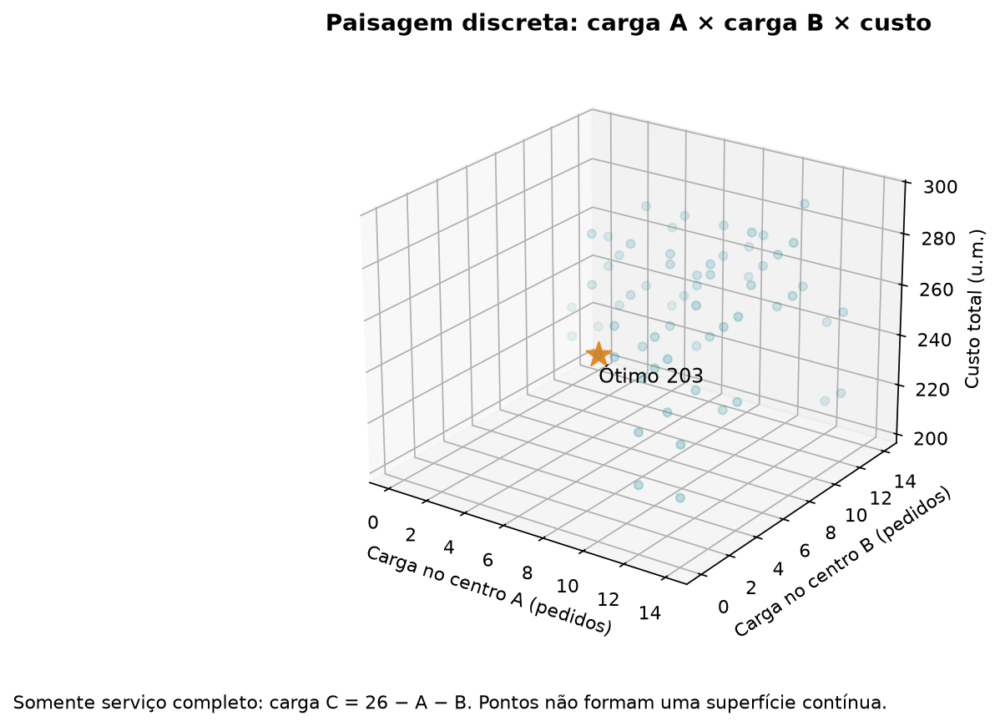

---

## Os métodos, explicados

| Método | Ideia | Ponto forte | Ponto fraco |
|---|---|---|---|
| **Guloso** | Abre centros um a um, escolhendo o de maior economia imediata | Instantâneo | Ignora o custo de abrir na escolha; pode errar muito (46% de gap médio em Holmberg) |
| **Busca local** | Parte do guloso e troca/abre/fecha centros enquanto melhora | Barata e robusta | Fica presa em ótimos locais |
| **MILP** | Resolve o modelo inteiro com branch-and-bound (SCIP via OR-Tools) | Dá **prova** de otimalidade quando termina | Perde fôlego em instâncias grandes |
| **MILP aquecido** | Mesmo MILP, começando de uma solução boa (a da busca local) | Incumbente bom desde o início | O aquecimento consome parte do orçamento |
| **LNS** (matheurística) | A cada iteração, solta uma vizinhança de regiões e reotimiza **só ela** com um subproblema exato, mantendo o resto fixo | Escala bem e mistura exatidão local com busca global | Não prova otimalidade; depende do tamanho da vizinhança |
| **Relaxação linear (PL)** | Permite `y` e `x` fracionários | Dá um **limite inferior**: nenhuma solução inteira custa menos | Não é uma solução operacional |

**Como ler um gap.** Para minimização, `LB ≤ ótimo ≤ UB`. `UB` é o custo de uma solução viável; `LB` vem da relaxação ou do solver. Este projeto reporta dois tipos de gap, e eles não são a mesma coisa:

- **Distância até o limite inferior (`gap_ub`)**: `(UB − LB) / UB`. Quanto a solução pode ainda estar acima do ótimo, no máximo.
- **Excesso sobre o ótimo ou o melhor conhecido**: só existe quando o ótimo é conhecido (Holmberg) ou usamos o melhor custo encontrado como referência.

Os métodos da linha de pesquisa (expansão adaptativa, Kernel Search, CLNS) estão descritos na [seção própria](#o-método-híbrido); eles usam o modelo estrito e outro executor.

**Uma leitura útil do dual.** O valor dual da restrição de capacidade, multiplicado por `y`, estima o ganho de uma unidade a mais de capacidade em um centro aberto (teorema do envelope). Isso aparece nos capítulos didáticos como "valor marginal da capacidade".

---

## Arquitetura

```
bronze ─────▶ silver ─────▶ gold ─────▶ instância ─────▶ solvers ─────▶ avaliação única
HTML, CSV,    tabelas       frete,       imutável,         guloso          custo, viabilidade,
JSON brutos   tipadas       aluguel,     validada          busca local     pedido não atendido
+ hash e      e limpas      painel                         LNS · MILP
data de                     rastreável                     PL (limite)
coleta                      ao bronze
```

Princípios que moldaram o código:

- **O domínio não depende de nenhum solver.** `Instance` e `Solution` ([`domain/`](src/alocacao_capacitada/domain)) são puros, imutáveis (arrays somente leitura) e validados na construção: NaN, infinito, IDs repetidos e atribuições fora do intervalo são recusados.
- **Avaliação única.** Toda solução passa por [`domain/evaluation.py`](src/alocacao_capacitada/domain/evaluation.py). Nenhum método avalia a si mesmo; o custo reportado é sempre o mesmo código, independentemente de quem produziu a solução.
- **Um modelo só.** [`solvers/model.py`](src/alocacao_capacitada/solvers/model.py) alimenta o MILP e a relaxação linear. Há uma variante com demanda divisível, usada apenas para validar contra a OR-Library.
- **Proveniência em tudo.** Cada arquivo bruto guarda URL, data, status e hash SHA-256 ao lado (`*.provenance.json`).
- **Coleta polida.** A coleta de páginas respeita o `robots.txt`, usa user-agent identificado, espera entre requisições e usa cache; não há proxy nem disfarce de navegador. O [Cavuca](https://github.com/EstevezCodando/Cavuca) é **dependência opcional**: sem ele, basta fornecer outra função de busca ao coletor.
- **Falhas visíveis.** Resultados negativos e erros que quase passaram ficam no repositório, não escondidos (ver [limitações](#limitações-e-honestidade-dos-números)).
- **A pesquisa é uma camada separada.** [`pesquisa/`](src/alocacao_capacitada/pesquisa) tem o próprio tipo de instância (`Problema`), o próprio validador e o próprio executor, e fala com o SCIP 10 diretamente pelo PySCIPOpt. Ela reaproveita do restante o LNS e as heurísticas construtivas, como baselines, e os leitores de Olist, frete e Holmberg. As dependências dela ficam em um grupo opcional (`uv sync --group pesquisa`), para que o estudo aplicado continue leve.

---

## Dados e fontes

Tudo é dado aberto ou público. Os brutos ficam em `data/bronze/`; as tabelas tratadas, em `data/reference/`; as instâncias, os rótulos e os modelos da pesquisa, em `data/processed/pesquisa/`, com hash em [`data/frozen/LOCK.json`](data/frozen/LOCK.json).

| Fonte | O que traz | Papel no projeto | Limite declarado |
|---|---|---|---|
| **Olist** (Kaggle) | 99.441 pedidos (96.478 entregues), clientes e vendedores, 2016–2018 | Demanda histórica e geografia (850 regiões de CEP) | Um marketplace específico, concentrado no Sudeste; não mede o mercado inteiro |
| **IBGE** (SIDRA, Censo 2022, malhas) | População 2000/2010/2022 e estimativas anuais, idade, PIB, polígonos municipais | Exposição populacional, previsão e geometria | Datas e revisões diferentes entre tabelas |
| **Ipeadata** | IDHM, renda per capita, Gini | Atributos socioeconômicos | **Decenais: o último é de 2010** |
| **ANTT** (Res. 6.076 e 6.084) | Piso mínimo de frete por viagem | Custo de transporte por pedido | Piso por viagem não é a tarifa observada por pedido |
| **Aluguel de galpões** | 8.700+ anúncios de 18 cidades (faixa de 1.001 a 3.000 m²), fev/2026 | Custo fixo por estado | Preço **pedido**, não contrato; média por estado; termos de uso do site não conferidos |
| **OSRM** (servidor de demonstração) | Distâncias e tempos de estrada | Frete da rede nacional e score | Serviço compartilhado; rotas sem resposta são imputadas por linha reta × 1,29 |
| **OpenStreetMap** (extratos do Geofabrik) | Rodovias, arruamentos, galpões e zonas industriais de S, SE e CO | Variáveis de infraestrutura e visualização | Completude varia entre cidades; objeto no mapa não prova imóvel disponível |
| **OR-Library** e **Holmberg et al.** | Instâncias de benchmark com ótimos publicados | Validação do solver e âncora externa da pesquisa | Ótimos de Holmberg transcritos à mão de um visualizador |
| **Instâncias sintéticas** (gerador próprio, adaptado de Cornuéjols et al., 1991) | 256 instâncias (240 de 30 × 150 e 16 de 50 × 200) em três famílias espaciais, com rótulos de qualidade | Treino, validação e teste da linha de pesquisa | Sintéticas; a família `corredor` nunca entra em treino |

**Datação das variáveis (para não vazar o futuro).** Pedidos são de 2016–2018 (a janela de modelagem é jan/2017 a ago/2018, 20 meses). IDHM, renda e Gini são de 2010. Faixa etária e crescimento vêm do Censo 2022. Usar 2022 para explicar 2017–2018 é análise **retrospectiva**, não previsão disponível à época; isso é dito onde importa.

**Cobertura do painel Olist→município.** 98,78% dos pedidos caem em polígono do IBGE, 1,15% resolvem por nome e 0,07% ficam sem município. 3.955 dos 5.571 municípios têm pedidos; a ausência de pedidos não demonstra ausência de mercado.

---

## Camada territorial e aprendizado de máquina

O Olist cobre bem alguns municípios e quase nada de outros. A camada territorial usa dados abertos para estimar a demanda onde não há pedidos e para olhar para o futuro, não só para o passado.

### Demanda por município (`ml/demand_model.py`)

Modelo supervisionado da **taxa de pedidos por habitante**, com peso igual à população (equivale a uma regressão de Poisson com exposição). Variáveis: população, crescimento, faixas etárias, IDHM (geral, renda, educação), renda, Gini, PIB per capita e distância ao polo vendedor.

- **Validação espacial, nunca aleatória.** Vizinhos se parecem e inflariam o resultado. Cada município é previsto por um modelo que **não viu o seu estado** (5 dobras de UFs) ou **a sua macrorregião** (deixa uma de fora por vez).
- **Modelos comparados:** proporcional à população (baseline), GLM de Poisson só com população e distância, GLM completo e gradient boosting.
- **Importância por permutação** e **calibração por decil** acompanham os números.

### Previsão de população (`ml/forecast.py`)

Estima a população de 2025 a 2030 por município. Duas validações contam histórias diferentes:

| Teste | Erro mediano | Leitura |
|---|---:|---|
| Contra a série **oficial** de estimativas | ~1,5% | **Engana**: as estimativas oficiais são modeladas e suaves |
| Contra o **Censo 2022** real (usando só 2000 e 2010) | ~9% na extrapolação simples | Honesto: o crescimento desacelerou e a extrapolação superestima |

O modelo final usa taxa encolhida ao grupo do município, amortecimento ao longo dos anos (escolhido por validação espacial) e uma trava de plausibilidade. O amortecimento reduziu o erro contra o Censo de 10–13% para 6–8%.

### Clusterização (`ml/clustering.py`)

k-means com escolha de k por silhueta **e** estabilidade sob reamostragem (índice de Rand ajustado). k = 3 foi o mais estável (ARI 0,98); com mais grupos a estabilidade cai para 0,78. Os nomes dos grupos são interpretações do perfil, não rótulos do algoritmo.

### Score de candidatos (`ml/scoring.py`)

Usa o otimizador como professor: resolve a rede em vários cenários, marca cada candidato como aberto ou não, e treina um classificador para prever isso a partir das características do município. A validação deixa uma macrorregião de fora. **O que importa não é o AUC, e sim se a rede restrita aos melhores candidatos custa quase o mesmo** que a rede com todos.

---

## Rede nacional e visão de futuro

Uma operadora hipotética com **10% do mercado** decide onde abrir módulos de **100 mil ou 250 mil pedidos por mês**.

- **Demanda potencial** = taxa estimada × população projetada × volume nacional de pedidos (435,6 milhões em 2025, projeção da ABComm, fonte setorial não auditada), com crescimento anual dos pedidos de 3%, 6% ou 9% como cenários baixo, base e alto (premissa).
- **Zonas de demanda.** Com fonte única, um município com mais demanda que um módulo ficaria sem atendimento (São Paulo, Rio). A solução é dividi-lo em zonas menores, co-localizadas.
- **Terceirização como válvula**, a R$ 100 por pedido (premissa): evita o modelo "obrigado a atender tudo".
- **Distância de estrada** do OpenStreetMap (OSRM), em blocos 50×50, com cache.
- **Arrependimento (regret).** Fixa-se a capacidade instalada (o *projeto*) e avalia-se o custo em cada cenário de 2030, reotimizando só a atribuição. Arrependimento = excesso de custo sobre o melhor projeto daquele cenário.

Também se testa se **uma previsão melhor de população muda a decisão** (projetos feitos com cada previsão e avaliados no Censo 2022 real) e se a **linha reta engana** em relação à estrada.

---

## Foco no Sul, Sudeste e Centro-Oeste, com vias do OpenStreetMap

O Olist quase não tem pedidos no Norte e no Nordeste; para lá, o modelo extrapola. Esta etapa **descarta essas regiões** e enriquece as demais.

**O que foi feito**

1. **Recorte:** 3.327 municípios de 11 UFs (MG, ES, RJ, SP, PR, SC, RS, MS, MT, GO, DF). O volume total é a fração do mercado nacional atribuída a essas UFs pelo modelo nacional (89%); a distribuição entre municípios vem de um modelo treinado só com elas.
2. **Extratos do OpenStreetMap** (Geofabrik, versão de 30/09/2026, licença ODbL): Centro-Oeste 206 MB, Sul 426 MB e Sudeste 860 MB, com MD5 conferido.
3. **Rodovias e arruamentos em shapefile**, por região (4,4 GB, fora do git):

| Região | Trechos de rodovia | Trechos de arruamento | Polígonos de galpão/zona industrial |
|---|---:|---:|---:|
| Centro-Oeste | 56.704 | 574.836 | 3.528 |
| Sul | 129.389 | 1.126.048 | 18.790 |
| Sudeste | 258.465 | 2.253.799 | 27.909 |

   *Rodovias*: `motorway`, `trunk`, `primary`, `secondary` e acessos. *Arruamentos*: `tertiary`, `unclassified`, `residential`, `living_street`, `service`. Ficam de fora trilhas, caminhos, calçadas, ciclovias e vias em construção.
4. **Agregação por município** ([`data/reference/osm_vias_municipio.csv`](data/reference/osm_vias_municipio.csv), [`osm_industrial_municipio.csv`](data/reference/osm_industrial_municipio.csv)): quilômetros por classe, densidade por km² e área de galpões e zonas industriais. Comprimentos em SIRGAS 2000 / Brazil Polyconic; cada trecho vai ao município do seu ponto médio.
5. **Refeitos com o recorte:** modelo de demanda, rede, score de candidatos, mapa. Saídas em [`results/foco/`](results/foco).

**O que se descobriu (inclusive o que não funcionou)**

| Modelo de demanda (validação por UF) | Deviance (menor é melhor) | Validação por região |
|---|---:|---:|
| GBM nacional, avaliado só nos municípios do foco | 4,21 | 6,21 |
| **GBM treinado só no foco** | **3,88** | 6,52 |
| GBM no foco, **com variáveis do OSM** | 4,25 | 6,60 |

- Restringir ajuda um pouco por UF e atrapalha por região (sobram duas regiões para treinar).
- **As variáveis do OSM não melhoraram** a previsão. A hipótese, **não testada**, é que a densidade viária funciona como substituta de população e urbanização, que o modelo já tem.
- **No score de candidatos o OSM também piorou o AUC** (0,667 a 0,710, contra 0,693 a 0,716 sem). A demanda local sozinha (0,718) é tão boa quanto os modelos.
- **A ordem dos filtros de candidatos não se manteve** entre a rede nacional e a regional: um score precisa ser validado em cada instância.

---

## Resultados

### Olist: distância até o limite inferior (quanto menor, melhor)

Frete ANTT de 2 eixos. 30 s em 50×15 e 100×30; 60 s em 200×50. LNS com 3 a 5 sementes.

| Instância (regiões × centros) | Guloso | Busca local | MILP | MILP + aquecimento | LNS (média) |
|---|---:|---:|---:|---:|---:|
| 50 × 15 | 14,05% | 5,55% | 1,70% | 1,15% | **0,85%** |
| 100 × 30 | 4,63% | 3,93% | 1,92% | **1,51%** | 1,57% |
| 200 × 50 | 5,01% | 3,42% | 1,80% | 1,99% | **0,63%** |

O limite do PL garante que o ótimo inteiro está no máximo nessa distância; não é o ótimo em si.

### Evolução do LNS

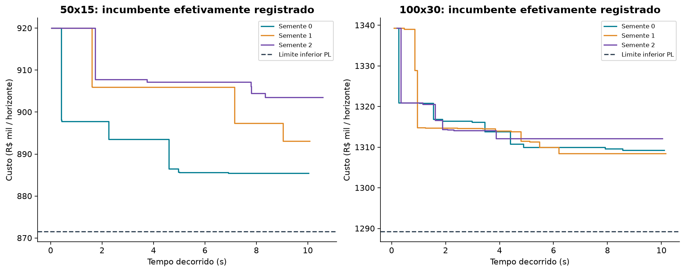

### Custos reais

**Aluguel.** O custo fixo de cada centro é `aluguel do estado × capacidade ÷ densidade`, em que a densidade (pedidos por m² por mês) é premissa. Estados sem anúncio usam a média e são marcados como imputados. Em 100 × 30:

| Densidade | Centros abertos | Custo fixo no custo total |
|---|---:|---:|
| Premissa antiga | 28 | 4,3% |
| 2 pedidos/m²/mês | 25 | 29,8% |
| 5 | 27 | 15,8% |
| 10 | 27 | 9,1% |
| 25 | 29 | 4,2% |

Com aluguel real a rede muda pouco, e o frete continua dominando a decisão.

**Um erro que quase passou.** A primeira tentativa usou 5.000 m² fixos por centro. O modelo abriu 2 centros e deixou 28.806 pedidos sem atendimento, porque em escala Olist um galpão desse tamanho custa mais que a entrega dos pedidos que comporta. A correção foi ligar a área à capacidade; o resultado antigo está em [`results/aluguel_area_fixa.csv`](results/aluguel_area_fixa.csv).

### Sensibilidade

Variação de um parâmetro por vez, com o mesmo MILP, mesma tolerância e mesmo limite de tempo. Demanda e capacidade são variadas **separadamente e em conjunto**, porque são coisas diferentes.

| Parâmetro | Efeito |
|---|---|
| **Folga de capacidade** | O único que muda a rede de forma relevante (de 15 centros com folga 1,1 para 9 com folga 3,0) |
| **Demanda com capacidade congelada** | Custo cresce ~3× de 0,6× a 1,4× e a rede abre 6 centros a mais |
| **Demanda e capacidade juntas** | A rede de 14 centros se mantém: o que muda é o custo |
| **Custo fixo** | Pouco sensível: 16× no custo fixo muda ~6% do total |
| **Pedidos por veículo** | Escala o custo quase na razão inversa; é a premissa de maior impacto e a menos fundamentada |
| **Atribuição de regiões** | Mesmo com a rede estável, 35% a 56% do volume muda de centro |

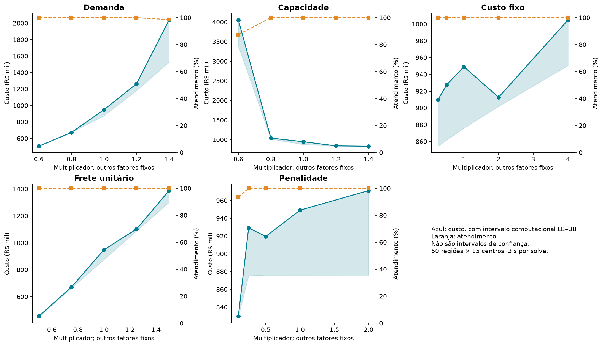

### Demanda incerta (dois estágios, SAA)

O projeto é escolhido **antes** de conhecer a demanda e a atribuição **depois**. VSS é o ganho de modelar a incerteza; EVPI é quanto valeria saber o futuro.

- **24 execuções** (folga 1,5 e 1,1, choque comum ρ de 0 e 0,5, σ de 0,5 e 0,8, 3 réplicas). Em **21**, a política estocástica é igual à determinística (VSS = 0).
- Nas **3 restantes** o VSS saiu negativo, o que é **impossível com solução ótima** (a política determinística é admissível no problema estocástico). É gap do solver (até 12,6%), não ganho.
- Com folga 1,1 os gaps chegam a 33% e o EVPI fica negativo em algumas réplicas; **não afirmo nada** sobre o valor da informação nesse regime.

### Rede nacional: o projeto de 2025 envelhece mal

Arrependimento sobre o melhor projeto de cada cenário (rede nacional, 400 nós, 60 candidatos):

| Projeto ↓ / cenário → | 2025 | 2030 base | 2030 baixo | 2030 alto |
|---|---:|---:|---:|---:|
| Para 2025 (38 módulos) | **0%** | **+47,2%** | +4,8% | **+209%** |
| Para 2030 base (44) | +2,6% | +0,5% | +0,3% | +13,9% |
| **Robusto, média dos 3** (44) | +2,3% | **0%** | **0%** | +14,3% |
| Para 2030 alto (48) | +9,6% | +4,2% | +6,0% | **0%** |

No recorte **S+SE+CO** o padrão se repete, mais suave: o projeto de 2025 (34 módulos) custa +25,5% em 2030 base e +206% no cenário alto; o robusto (38 módulos) custa +3,0% em 2025 e fica a 0% nos cenários base e baixo. As redes são diferentes (menos nós, outro volume), então a comparação entre os dois recortes é qualitativa.

Outras leituras:

- **Antecipar custa pouco; não antecipar custa muito.** O projeto robusto custa 2,3% a mais que o de 2025 se a demanda de 2025 persistir.
- **Previsão melhor ≠ decisão melhor.** A previsão com menor erro de população produziu o pior dos cinco projetos por pequena margem; todos ficaram a menos de 1% do projeto feito com o Censo real.
- **Estrada ou linha reta:** o projeto feito com linha reta custa +1,3% (nacional) e +0,9% (foco) quando avaliado na estrada, mas **compartilha só 70% a 79% dos módulos**. O custo é plano perto do ótimo.

### Score de candidatos

Custo da rede restrita aos K melhores candidatos, como excesso sobre o melhor custo conhecido (média de 4 execuções na rede nacional; 3 sementes no foco):

| Filtro | Nacional, K = 60 | Nacional, K = 45 | Foco, K = 60 | Foco, K = 45 |
|---|---:|---:|---:|---:|
| Regressão logística | **+0,2%** | **+1,9%** | +3,3% | +12,5% |
| Gradient boosting | +3,9% | +5,1% | **+0,15%** | +1,4% |
| Demanda local | +4,0% | +8,8% | +1,0% | +2,1% |
| Todos os 120 candidatos | +1,6% | | +3,2% | |

Com K = 30 todos os filtros falham (de +19% a +64% na rede nacional): há um K mínimo abaixo do qual o problema muda. E o filtro vencedor de uma rede é o pior da outra.

### Mapa interativo

[`docs/index.html`](docs/index.html) traz o mapa da rede (MapLibre GL) com fronteiras do IBGE embutidas, ruas do [OpenFreeMap](https://openfreemap.org/) (dados © OpenStreetMap) e seis vistas (três nacionais, três do recorte S+SE+CO). As linhas nó→centro são retas ilustrativas; o custo usa a distância viária (a estrada alonga o caminho em 1,29× na mediana e 1,49× no p90). Tem tema claro e escuro e uma versão estática de reserva quando WebGL não está disponível.

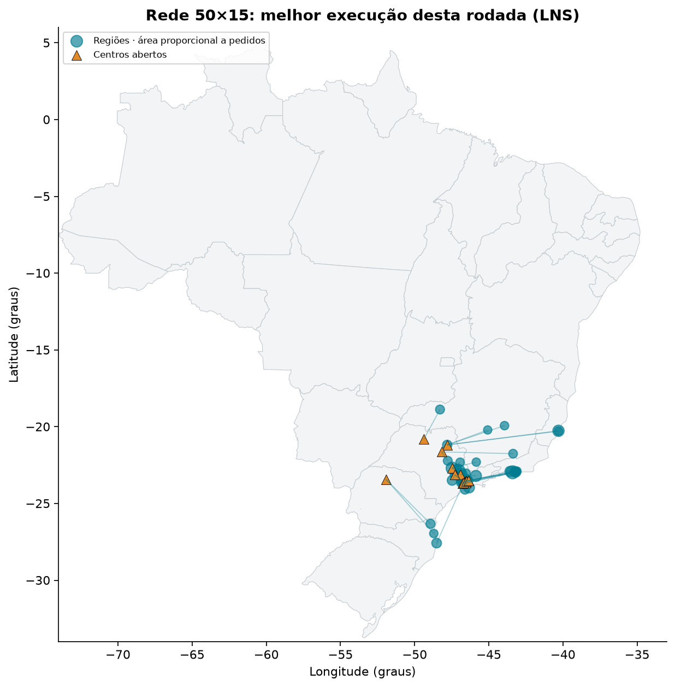

---

## Validação externa

Antes de confiar nos números, o modelo foi confrontado com resultados publicados.

- **OR-Library:** o modelo com demanda divisível reproduz os **7 ótimos publicados** (cap41–44, 51, 61, 71). Valida a formulação, não o LNS.
- **Holmberg et al. (1999):** 71 instâncias de fonte única com ótimo publicado, o benchmark certo para este problema. Até 30 centros e 200 clientes; 10 s por método.

| Método | Gap médio | Mediana | Igual à referência¹ | Provado pelo solver² | Tempo médio |
|---|---:|---:|---:|---:|---:|
| Guloso | 46,56% | 49,13% | 0 | – | 0,0 s |
| Busca local | 3,14% | 2,81% | 3 | – | 0,6 s |
| LNS, vizinhança de 12 | 2,05% | 1,24% | 18 | – | 10,0 s |
| LNS, vizinhança de 60 | 0,59% | 0,06% | 30 (+1 a 0,0095%) | – | 10,1 s |
| **MILP** | **0,20%** | **0,00%** | **61** | **60** | 2,6 s |

¹ Custo idêntico ao publicado (tolerância relativa 10⁻⁶). ² Status `OTIMO` do solver; coincidir com a referência e provar a otimalidade são evidências diferentes.

**Achado central.** Nos recortes do Olist, de capacidade folgada, o LNS fica no nível do MILP ou melhor; com capacidade apertada (Holmberg) o MILP domina, e o LNS só se aproxima com vizinhanças maiores. A folga de capacidade é uma **hipótese** para a diferença, não um fato isolado: as famílias de instâncias também diferem em geografia, custos e tamanho.

**O que a validação revelou**

- Em cap41–44 e cap51 há clientes com demanda maior que a capacidade de qualquer centro: inviáveis com fonte única.
- Alguns arquivos de Holmberg trazem cabeçalhos de e-mail de 1995 e bytes nulos, que o carregador ignora.
- Coeficientes de frete de um blog diferiam dos oficiais em até 8%, o que tornou obrigatória a fonte primária.

---

## Linha de pesquisa: aprender o espaço de busca

> Pesquisa aberta, em andamento, para um artigo e para o mestrado. Tudo o que está nesta seção
> vem de execuções registradas em [`results/pesquisa/`](results/pesquisa), com manifesto e hash
> dos dados. Há dois níveis de evidência, sempre rotulados: **pilotos** em 16 instâncias de
> validação (exploratórios) e o **teste fechado** em 139 instâncias nunca usadas antes, com
> métodos, orçamentos e hipóteses [pré-registrados](docs/pesquisa/10-preregistro-teste-fechado.md).
>
> **Resultado principal (teste fechado, 05/10/2026):** restringir os centros pelo ranking da
> relaxação linear reduziu a integral primal a menos da metade da do SCIP no modelo completo
> (p < 0,001). Trocar esse ranking pelo de uma GNN **piorou** o resultado de forma significativa
> (p = 0,004 com correção de Holm). Vale para esta GNN e este orçamento de treino; parte do teste
> rodou com a máquina ocupada. [Ir para os resultados](#o-teste-fechado).
>
> Relatório completo: [`docs/pesquisa/09-relatorio-geral.md`](docs/pesquisa/09-relatorio-geral.md) ·
> Manuscrito: [`paper/`](paper) ·
> Curadoria de artigos da área: [ML-for-Location-and-Routing-Optimization-Papers](https://github.com/EstevezCodando/ML-for-Location-and-Routing-Optimization-Papers)

### A pergunta

O problema desta parte é o **SSCFLP estrito**: o mesmo modelo de localização capacitada com fonte
única, mas **sem** a variável de demanda não atendida (todo cliente tem de ser alocado). Com 30
centros e 150 clientes, o SCIP 10 não prova o ótimo em 60 s (gap certificado de 1,8% a 3,6%).

A literatura recente propõe usar aprendizado de máquina para **reduzir o espaço de busca**:
podar centros, escolher vizinhanças, imitar regras de branching. A pergunta da pesquisa é quanto
desse ganho se sustenta quando (a) a capacidade acopla os subproblemas e (b) cada método
aprendido é comparado com o **equivalente clássico de mesma função**, no mesmo tempo de parede.

### O caminho percorrido

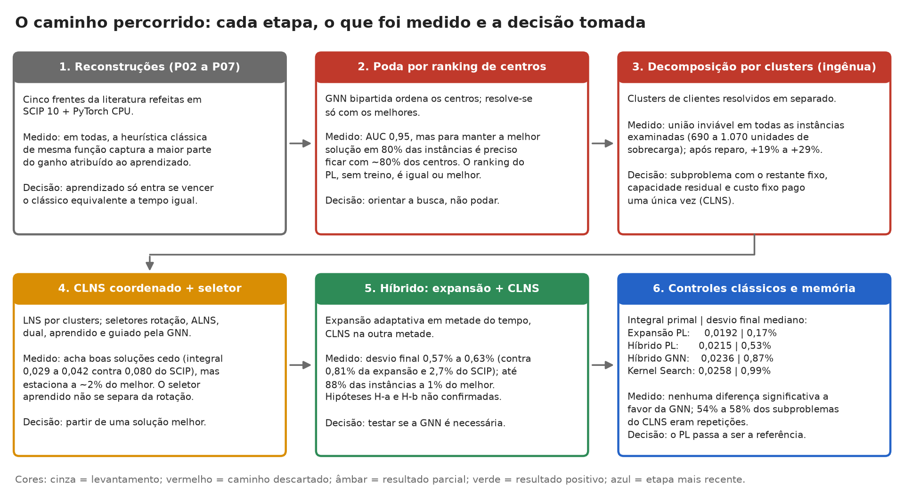

*A figura cobre as seis etapas de desenvolvimento; a sétima, o teste fechado, está na tabela abaixo e na [seção própria](#o-teste-fechado). Cada caixa traz o que foi feito, o que foi medido e a decisão que levou à etapa seguinte.
Vermelho marca caminhos descartados com base em medição; verde, resultado positivo; azul, a
etapa mais recente.*

| Etapa | O que foi feito | O que foi medido | Decisão |
|---|---|---|---|
| 1. Reconstruções | Cinco frentes da literatura refeitas em SCIP 10 e PyTorch em CPU | A heurística clássica de mesma função captura a maior parte do ganho em todas | Aprendizado só entra se vencer o clássico equivalente |
| 2. Poda por ranking | GNN bipartida ordena os centros; resolve-se só com os melhores | Para manter a melhor solução em 80% das instâncias é preciso ficar com ~80% dos centros; o PL sem treino é igual ou melhor | Orientar a busca em vez de podar |
| 3. Clusters, versão ingênua | Clusters de clientes resolvidos em separado | União inviável em todas as instâncias examinadas; +19% a +29% depois do reparo | Subproblema com o restante fixo e capacidade residual (CLNS) |
| 4. CLNS com seletores | LNS por clusters com seletor por rotação, ALNS, dual, aprendido e guiado pela GNN | Bom cedo (integral primal 0,029 a 0,042 contra 0,080 do SCIP), mas estaciona a ~2% | Partir de uma solução melhor |
| 5. Híbrido | Expansão adaptativa em metade do tempo, CLNS na outra metade | Desvio final de 0,57% a 0,63%, contra 0,81% da expansão e 2,66% do SCIP | Testar se a GNN é necessária |
| 6. Controles e memória | Kernel Search, híbrido só com PL, memória de subproblemas | Nenhuma diferença significativa a favor da GNN; 54% a 58% dos subproblemas do CLNS eram repetições | O ranking do PL passa a ser a referência; congelar o método e testar |
| 7. Teste fechado | 1.390 execuções em 139 instâncias novas, com hipóteses pré-registradas | Expansão com PL tem menos da metade da integral do SCIP; com GNN, piora de forma significativa | Replicar dois conjuntos com a máquina ociosa; isolar o efeito do agrupamento |

### Por que a capacidade muda tudo

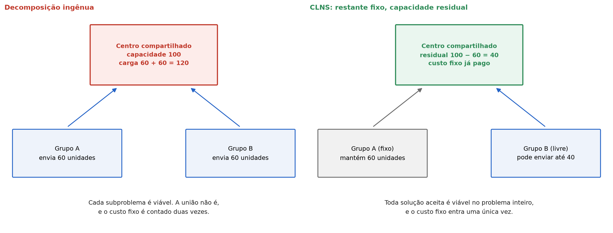

*À esquerda, dois grupos resolvidos em separado enviam 60 unidades cada um ao mesmo centro de
capacidade 100: cada subproblema é viável, a união não é, e o custo fixo aparece duas vezes. À
direita, o que o CLNS faz: o grupo fixo mantém suas 60 unidades, o grupo livre enxerga só as 40
restantes e não paga de novo o custo fixo. Por construção, toda solução aceita é viável no
problema inteiro.*

### Poda por ranking não é segura

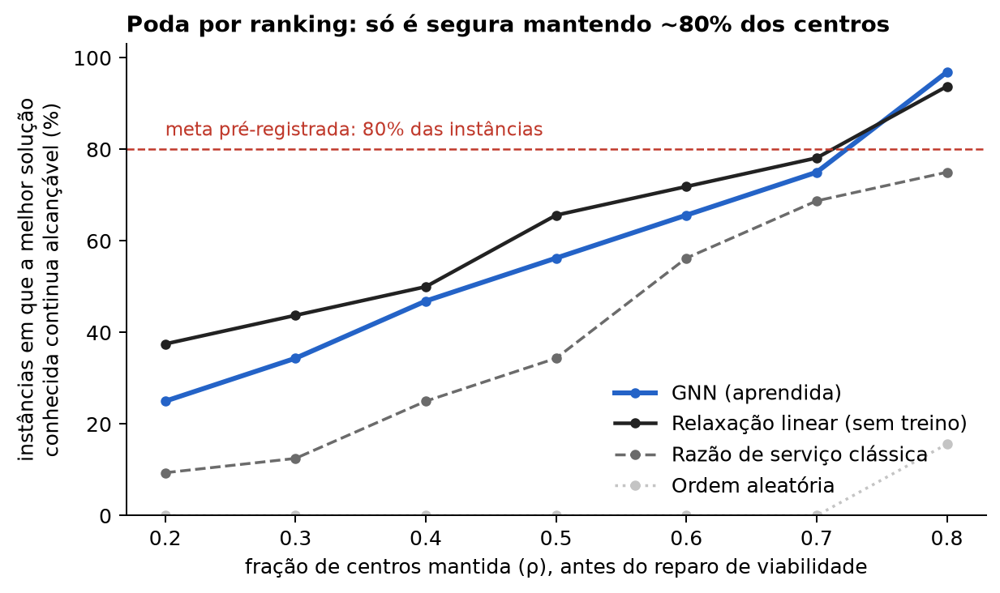

*Eixo horizontal: fração de centros mantida antes do reparo de viabilidade. Eixo vertical:
percentual das 32 instâncias de validação em que todos os centros da melhor solução conhecida
continuam disponíveis depois da poda. A linha tracejada é a meta registrada antes do experimento.
A GNN ordena melhor que a heurística clássica (AUC 0,95 contra 0,905), mas o ranking da relaxação
linear, sem treino, fica acima dela entre ρ = 0,2 e 0,7, e ambos só atingem a meta mantendo cerca
de 80% dos centros.*

### O método híbrido

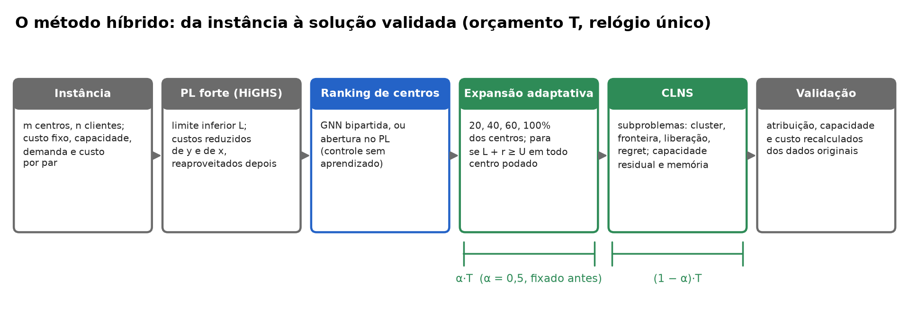

1. **Relaxação linear forte**, resolvida uma vez (HiGHS). Dela saem o limite inferior `L`, o
   custo reduzido `r_i` de cada centro e o custo reduzido `c̄_ij` de cada par.
2. **Ranking de centros**: pela GNN ou pelo valor de abertura no PL (controle sem aprendizado).
3. **Expansão adaptativa**: resolve o problema restrito aos 20%, 40%, 60% e 100% melhores
   centros, reaproveitando a solução anterior. Se um estágio fecha no ótimo com custo `U` e
   `L + r_i ≥ U` para todo centro deixado de fora, `U` é o **ótimo global provado** e a expansão
   para ali.
4. **CLNS**: reotimiza um subconjunto de clientes por vez (um cluster, dois clusters vizinhos, os
   clientes de um centro caro, os vizinhos do cliente com maior regret), com o restante fixo e a
   capacidade residual.
5. **Validação**: atribuição, capacidade e custo recalculados a partir dos dados originais.

### Piloto 2: o híbrido contra os demais

16 instâncias de validação (30 × 150), 60 s por execução, três sementes, 432 execuções. Duas
hipóteses foram registradas antes: (H-a) o híbrido com seletor GNN tem integral primal menor que
a expansão adaptativa sozinha; (H-b) dentro do híbrido, o seletor guiado pela GNN supera rotação
e aprendido.

**Como ler a integral primal.** É a área sob a curva do gap à melhor solução conhecida ao longo
do orçamento, dividida pelo orçamento. Vale 0 quando a melhor solução está disponível desde o
início e 1 quando nenhuma solução aparece. Premia achar boas soluções cedo; o desvio final mede
só onde o método termina.

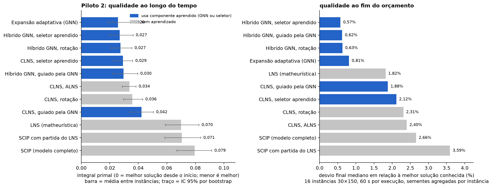

*Esquerda: integral primal média (área sob a curva do gap ao longo do orçamento, de 0 a 1; menor
é melhor); o traço é o intervalo de confiança de 95% por bootstrap sobre instâncias. Direita:
desvio final mediano em relação à melhor solução conhecida. Azul marca os métodos com algum
componente aprendido.*

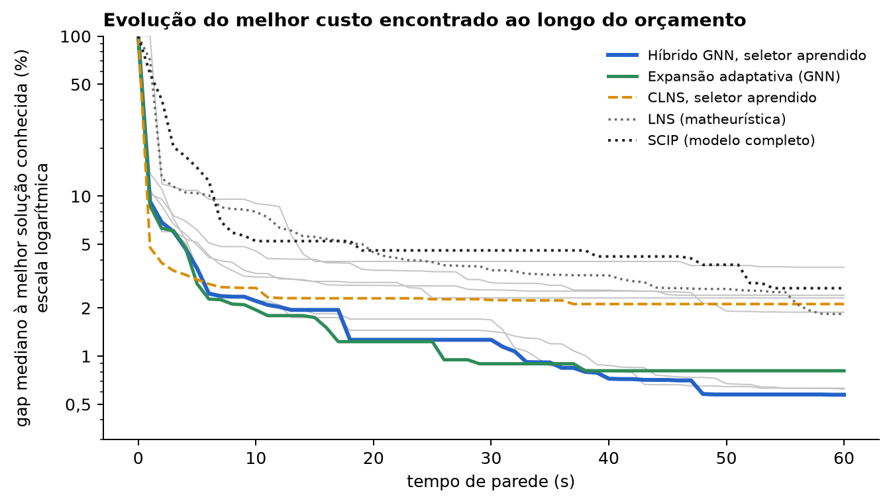

*Para cada segundo, a mediana entre instâncias do gap à melhor solução conhecida, em escala
logarítmica. Depois dos 30 s a expansão estaciona e a fase de CLNS do híbrido continua melhorando. As duas
curvas não têm de coincidir antes disso: a expansão sozinha reparte seus estágios a partir de
60 s, e o híbrido, a partir de 30 s.*

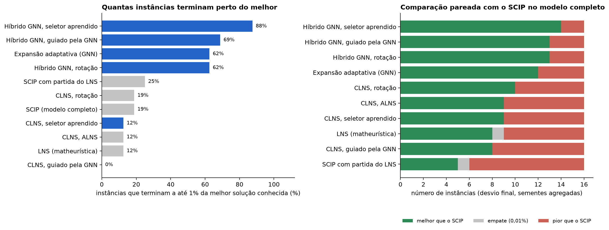

| Método | Integral primal (IC 95%) | Desvio final | Instâncias a até 1% |
|---|---|---:|---:|
| Expansão adaptativa (GNN) | 0,0257 (0,019–0,035) | 0,81% | 62,5% |
| Híbrido, seletor aprendido | 0,0270 (0,020–0,036) | 0,57% | 87,5% |
| Híbrido, rotação | 0,0274 (0,021–0,035) | 0,63% | 62,5% |
| Híbrido, guiado pela GNN | 0,0296 (0,022–0,040) | 0,62% | 68,8% |
| CLNS, seletor aprendido | 0,0292 (0,023–0,036) | 2,12% | 12,5% |
| LNS | 0,0700 (0,059–0,082) | 1,82% | 12,5% |
| SCIP (modelo completo) | 0,0795 (0,067–0,091) | 2,66% | 18,8% |

As duas hipóteses registradas antes do piloto **não se confirmaram**: o híbrido não tem integral
primal menor que a expansão sozinha, e o seletor guiado pela GNN não supera a rotação. O que o
híbrido melhora é o fim da execução.

### Piloto 3: o aprendizado é necessário?

As mesmas 16 instâncias de validação, 60 s, três sementes, 352 execuções, já com o código do
CLNS corrigido pela segunda auditoria. Repete SCIP, expansão com GNN, CLNS e híbrido com rotação,
e acrescenta três controles **sem nenhum componente treinado** e uma memória de subproblemas:

- **Kernel Search** (Guastaroba e Speranza, 2014): núcleo com os centros de `y > 0` no PL; os
  demais entram em baldes por custo reduzido crescente.
- **Expansão adaptativa ordenada pelo PL**: o mesmo algoritmo, com o valor de abertura da
  relaxação linear no lugar da nota da GNN.
- **Híbrido PL**: expansão ordenada pelo PL seguida de CLNS com rotação.
- **Memória de subproblemas**: uma tabela, indexada por um hash do conjunto livre, dos centros
  atuais desses clientes e da carga fixa por centro, que marca os subproblemas que já falharam. É
  uma heurística de alocação de esforço, com antecedentes em POPMUSIC e em *Learning to
  Delegate*; não é certificado, porque os subproblemas são interrompidos por tempo.

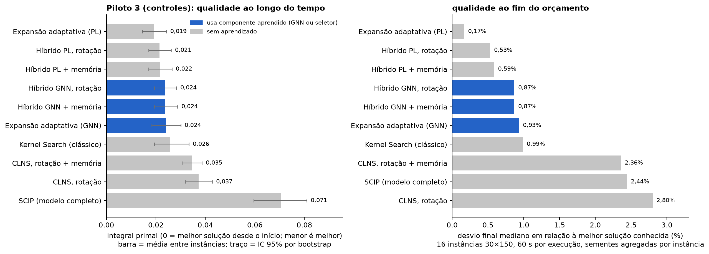

*Esquerda: integral primal média com intervalo de confiança de 95%. Direita: desvio final
mediano. Azul marca os métodos que usam a GNN; cinza, os que não usam nenhum componente
treinado. "PL" é o ranking tirado da relaxação linear.*

| Método | Aprende? | Integral primal (IC 95%) | Desvio final | Até 1% | Até 0,1% |
|---|:---:|---|---:|---:|---:|
| Expansão adaptativa (PL) | não | 0,0192 (0,015–0,024) | 0,17% | 56,3% | 43,8% |
| Híbrido PL, rotação | não | 0,0215 (0,017–0,026) | 0,53% | 75,0% | 18,8% |
| Híbrido PL, rotação + memória | não | 0,0217 (0,017–0,027) | 0,59% | 87,5% | 18,8% |
| Híbrido GNN, rotação | sim | 0,0236 (0,019–0,028) | 0,87% | 68,8% | 12,5% |
| Híbrido GNN, rotação + memória | sim | 0,0238 (0,019–0,029) | 0,87% | 68,8% | 12,5% |
| Expansão adaptativa (GNN) | sim | 0,0240 (0,018–0,030) | 0,93% | 50,0% | 12,5% |
| Kernel Search | não | 0,0258 (0,019–0,033) | 0,99% | 56,3% | 12,5% |
| CLNS, rotação + memória | não | 0,0347 (0,031–0,039) | 2,36% | 0,0% | 0,0% |
| CLNS, rotação | não | 0,0372 (0,032–0,043) | 2,80% | 0,0% | 0,0% |
| SCIP (modelo completo) | não | 0,0706 (0,060–0,081) | 2,44% | 18,8% | 6,3% |

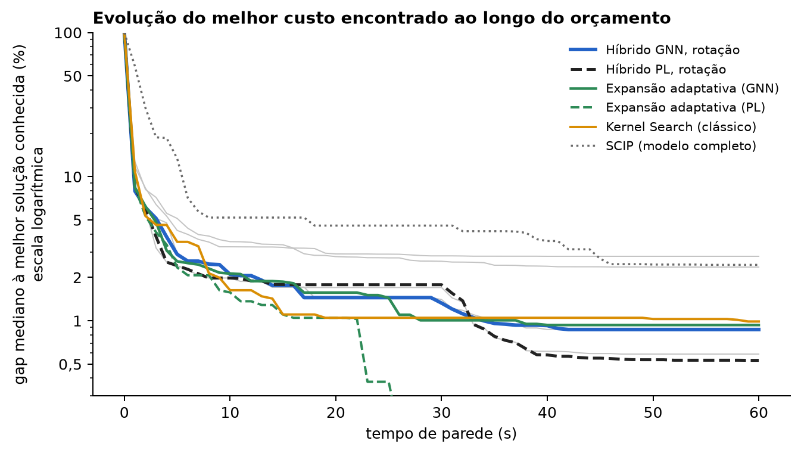

*Gap mediano à melhor solução conhecida a cada segundo, em escala logarítmica. Linhas
tracejadas são as variantes ordenadas pelo PL; contínuas, pela GNN.*

**Sem evidência de benefício da GNN.** Trocar a GNN pelo ranking do PL, que não precisa de dados
de treino, não piorou nenhum método; as estimativas pontuais favorecem o PL:

- expansão adaptativa: integral 0,0192 com PL contra 0,0240 com GNN; desvio final 0,17% contra
  0,93%; o PL tem a menor integral em 11 das 16 instâncias (Wilcoxon pareado, p = 0,13);
- híbrido: 0,0215 contra 0,0236; menor em 10 de 16 (p = 0,43).

Com 16 instâncias nenhuma dessas diferenças é significativa. A afirmação que se sustenta é a
mais fraca: **não há evidência de que o ranking aprendido ajude**, e as estimativas pontuais
favorecem o ranking sem aprendizado. O Kernel Search, o método clássico estabelecido, fica no
nível da expansão com GNN e vence o SCIP completo em 14 de 16 instâncias. O certificado de custo
reduzido fechou 1 das 16 instâncias antes do último estágio, com os dois rankings.

**O que a fase de CLNS acrescenta.** Com o ranking do PL, o híbrido não melhora a integral da
expansão sozinha (0,0215 contra 0,0192; p = 0,40). No fim da execução o efeito é misto: mais
instâncias terminam a até 1% (75,0% contra 56,3%), mas menos chegam a 0,1% (18,8% contra 43,8%).
A expansão com o orçamento inteiro fecha ou quase fecha as instâncias mais fáceis; o híbrido,
que interrompe a expansão na metade, troca isso por resultados mais estáveis nas difíceis. A
fração α passa a ser uma ablação necessária.

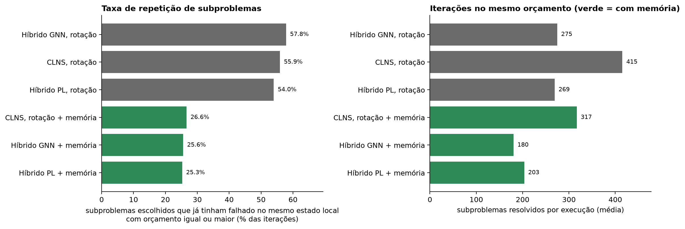

*Esquerda: percentual das iterações em que o subproblema escolhido já tinha falhado a partir do
mesmo estado local com limite de tempo igual ou maior. Direita: subproblemas resolvidos por
execução. Verde marca as variantes com memória.*

**Repetição e memória.** Sem memória, **54% a 58% dos subproblemas escolhidos pelo CLNS eram
repetições**: mais da metade das iterações rodou de novo um modelo que já tinha sido tentado sem
sucesso com limite igual ou maior. A memória elimina cerca de metade delas; os 25% a 27% restantes são iterações em que
**todos** os candidatos gerados já tinham falhado naquele limite. Isso **não** é certificado de
ótimo local: os subproblemas foram interrompidos por tempo, não resolvidos, e a lista de
candidatos é uma amostra das vizinhanças. O tempo liberado não virou ganho mensurável: no CLNS
sozinho a integral foi de 0,0372 para 0,0347 (p = 0,18) e o desvio de 2,80% para 2,36%
(p = 0,12); dentro dos híbridos, nenhuma mudança.

**Leitura conjunta, como hipótese.** Uma explicação compatível com os dados, mas não
demonstrada por eles, é que o CLNS seja limitado pelo **alcance** das vizinhanças (ou pelo corte
de dez centros por cliente, ou pelos limites curtos de tempo) mais do que pela ordem em que são
tentadas. Resolver de novo uma amostra de subproblemas repetidos com limite maior separaria
essas explicações; fica como próximo passo.

**Medição.** Mediana da razão CPU ÷ parede de 0,999; 7 das 352 execuções (2,0%) abaixo de 0,9,
todas no mesmo núcleo, que dividiu tempo com outras tarefas da máquina durante a rodada; estouro
de orçamento com percentil 95 de 0,04 s.

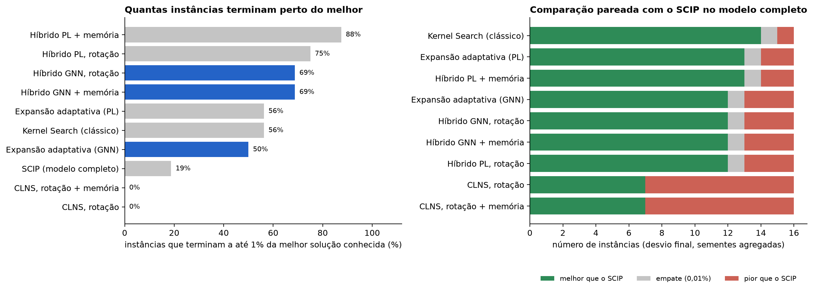


### As reconstruções da literatura

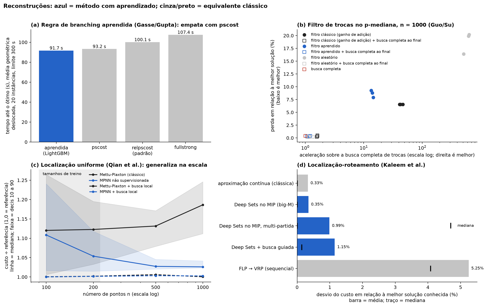

| Frente | Resultado nesta reconstrução |
|---|---|
| Branching aprendido (Gasse et al. 2019; Gupta et al. 2020) | 91,7 s contra 100,1 s do padrão do SCIP, mas indistinguível de `pscost` (93,2 s), que não usa aprendizado |
| Trocas guiadas (Guo et al. 2023; Su et al. 2024) | O filtro clássico sozinho dá 47× de aceleração com 6,6% de perda; a aceleração vem do filtro |
| Localização uniforme (Qian et al. 2026) | A MPNN generaliza na escala (1,03 contra 1,19 em n = 1000), é instável no treino e empata com o clássico depois da busca local |
| Rede neural dentro do MIP (Kaleem et al. 2024) | O MIP com Deep Sets não otimiza bem em solver aberto; a aproximação contínua clássica empata ou vence |

### Como o tempo é medido

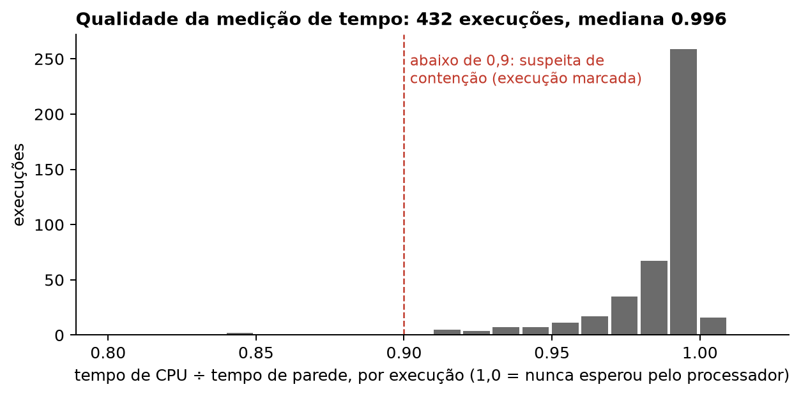

A comparação é por tempo de parede, então cada execução roda fixada em um núcleo físico, com uma
thread, e grava dois relógios (parede e CPU). A razão CPU ÷ parede abaixo de 0,9 marca suspeita
de contenção; a execução é mantida e sinalizada. Instâncias e modelos são congelados com hash
SHA-256 em [`data/frozen/LOCK.json`](data/frozen/LOCK.json), e o executor confere a trava antes
de cada rodada.

### Como reproduzir a pesquisa

```bash
uv sync --group pesquisa            # PySCIPOpt, PyTorch (CPU), LightGBM, psutil, matplotlib
uv run pytest tests/test_pesquisa_g0.py tests/test_clns.py tests/test_pesquisa_regressoes.py

# avaliação no mesmo orçamento, com registro versionado (manifesto + SQLite)
uv run python -m alocacao_capacitada.pesquisa.exp_clns avaliar --split validacao --tempo 60 --workers 3 --limite 16
uv run python scripts/agregados_clns.py results/pesquisa/clns/<run_id> --horizonte 60
uv run python scripts/figuras_pesquisa.py        # figuras desta seção
uv run python paper/figuras/gerar_figuras.py     # figuras do manuscrito
```

| Onde | O quê |
|---|---|
| `src/alocacao_capacitada/pesquisa/` | modelo estrito, PL com duais, gerador, GNN, expansão adaptativa, Kernel Search, CLNS, memória de subproblemas, medição, congelamento, reconstruções |
| `docs/pesquisa/` | pré-registros, relatórios por frente, auditorias e relatório geral |
| `paper/` | manuscrito em inglês (`journal/`, elsarticle), versão nas normas ABNT (`abnt/`) e versão curta (`short/`, LNCS) |
| `results/pesquisa/` | resultados brutos, agregados e manifestos |
| `data/processed/pesquisa/` | instâncias, rótulos e modelos congelados |

### O teste fechado

O teste fechado foi [pré-registrado](docs/pesquisa/10-preregistro-teste-fechado.md) depois do piloto 3 e antes de qualquer execução nas
instâncias abaixo: os seis métodos, os orçamentos, quatro hipóteses e o script de análise foram
commitados primeiro. São **1.390 execuções em 139 instâncias** que nenhum piloto tinha usado.

| Conjunto | Instâncias | Tamanho | Orçamento | O que mede |
|---|---:|---|---:|---|
| `teste` | 32 | 30 × 150 | 60 s | mesma distribuição do treino |
| `gen_corredor` | 16 | 30 × 150 | 60 s | família espacial nunca vista |
| `gen_escala` | 16 | 50 × 200 | 120 s | tamanho maior que o do treino |
| `holmberg` | 71 | 10–30 × 50–200 | 30 s | desvio contra o ótimo publicado |
| `olist` | 4 | 30 × 150 a 150 × 850 | 120 s | dados reais |

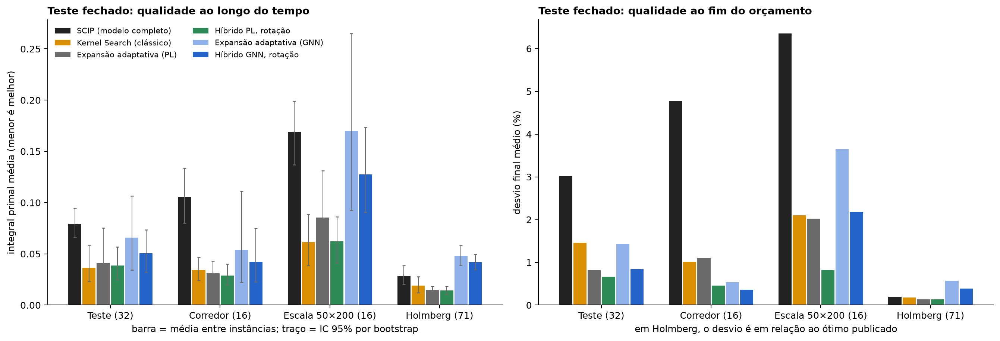

*Esquerda: integral primal média por conjunto, com intervalo de confiança de 95%. Direita: desvio
final médio (em Holmberg, contra o ótimo publicado). Preto é o SCIP no modelo completo; laranja,
o Kernel Search; cinza e verde, a expansão e o híbrido ordenados pelo PL, sem aprendizado; azul
claro e azul, os equivalentes ordenados pela GNN. Em cada conjunto, compare as barras azuis com
a cinza e a verde: a diferença é o efeito de trocar o ranking do PL pelo aprendido.*

**Resultado nas 64 instâncias sintéticas (teste + corredor + escala):**

| Método | Aprende? | Integral primal (IC 95%) | Desvio mediano | Até 1% | Melhor / igual / pior que o SCIP |
|---|:---:|---|---:|---:|---|
| Híbrido PL | não | 0,0420 (0,032–0,053) | 0,35% | 70,3% | 54 / 3 / 7 |
| Kernel Search | não | 0,0422 (0,032–0,055) | 0,74% | 57,8% | 46 / 6 / 12 |
| Expansão adaptativa (PL) | não | 0,0497 (0,033–0,070) | 0,50% | 65,6% | 50 / 7 / 7 |
| Híbrido GNN | sim | 0,0677 (0,051–0,087) | 0,62% | 59,4% | 53 / 3 / 8 |
| Expansão adaptativa (GNN) | sim | 0,0889 (0,058–0,124) | 0,64% | 56,3% | 42 / 9 / 13 |
| SCIP (modelo completo) | não | 0,1083 (0,093–0,124) | 3,72% | 23,4% | – |

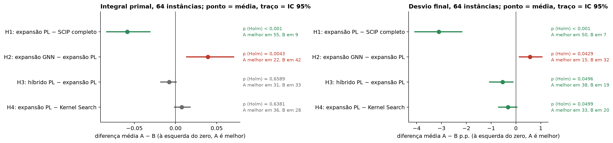

*Cada linha é uma comparação pareada A − B: o ponto é a diferença média por instância e o traço,
o intervalo de confiança de 95%. Traço inteiro à esquerda do zero significa que A é melhor. À
direita de cada linha, o valor-p de Wilcoxon corrigido por Holm e em quantas instâncias cada lado
venceu. Verde: significativo a favor de A; vermelho: significativo a favor de B; cinza: não
significativo.*

| Hipótese | Integral primal | Desvio final | Leitura |
|---|---|---|---|
| **H1** expansão PL contra SCIP completo | −0,059; p < 0,001 | −3,10 p.p.; p < 0,001 | **Restringir ajuda.** Menos da metade da integral do SCIP; melhor em 55 de 64 instâncias |
| **H2** expansão GNN contra expansão PL | +0,039; p = 0,004 | +0,57 p.p.; p = 0,043 | **O ranking aprendido é pior que o do PL.** O PL vence em 42 de 64 |
| **H3** híbrido PL contra expansão PL | −0,008; p = 0,66 | −0,54 p.p.; p = 0,0495 | A fase de CLNS não muda a velocidade; melhora o fim, no limiar de significância |
| **H4** expansão PL contra Kernel Search | +0,008; p = 0,64 | −0,32 p.p.; p = 0,0495 | Sem diferença que se possa afirmar |

**O que muda em relação aos pilotos.**

- Os pilotos só permitiam dizer que não havia evidência a favor da GNN. O teste fechado é mais
  forte: **trocar o ranking do PL pelo da GNN piora a expansão de forma significativa**, e a
  perda cresce longe da distribuição de treino. No conjunto de escala, com instâncias maiores
  que as do treino, a expansão com GNN (0,170) não é melhor que o SCIP completo (0,169),
  enquanto a com PL fica em 0,085.
- Na família corredor, nunca vista no treino, as variantes com GNN terminam com os menores
  desvios **medianos** (0,15% a 0,18%), mas com integral maior: o ranking aprendido não é
  uniformemente pior no fim, é mais lento para chegar.
- O Kernel Search, publicado em 2014 e sem aprendizado, fica no nível da expansão ordenada pelo
  PL e tem integral numericamente menor que as duas variantes aprendidas.
- Os dois valores-p de 0,0495 no desvio final estão no limiar. Não tiro conclusão deles.

**Holmberg (71 instâncias com ótimo publicado, 30 s).**

| Método | Integral primal (IC 95%) | Desvio médio | Ótimo atingido | Ótimo provado pelo certificado |
|---|---|---:|---:|---:|
| Híbrido PL | 0,0143 (0,011–0,018) | 0,13% | 59 | – |
| Expansão adaptativa (PL) | 0,0146 (0,011–0,018) | 0,14% | 61 | 59 |
| Kernel Search | 0,0191 (0,012–0,028) | 0,18% | 60 | – |
| SCIP (modelo completo) | 0,0286 (0,020–0,039) | 0,20% | 61 | – |
| Híbrido GNN | 0,0419 (0,035–0,050) | 0,39% | 53 | – |
| Expansão adaptativa (GNN) | 0,0481 (0,039–0,058) | 0,57% | 59 | 59 |

- **O certificado de custo reduzido funciona:** em 59 das 71 instâncias a expansão parou com o
  ótimo global **provado** antes do último estágio, com os dois rankings. Com o PL, em mediana
  de 0,9 s.
- A expansão com PL atinge tantos ótimos quanto o SCIP completo (61), com metade da integral.
- A GNN, treinada em instâncias euclidianas de 30 centros, transfere mal para estas: as
  variantes com GNN têm integral **maior** que a do SCIP completo.

**Olist (4 instâncias reais, 120 s), descritivo.** Desvio final em relação à melhor solução
conhecida:

| Método | 30 × 150 | 60 × 300 | 100 × 600 | 150 × 850 |
|---|---:|---:|---:|---:|
| Híbrido PL | 0,26% | 1,03% | 0,10% | 0,02% |
| Híbrido GNN | 0,19% | 0,73% | 0,15% | 0,02% |
| Kernel Search | 0,06% | 0,77% | 8,68% | 9,26% |
| SCIP (modelo completo) | 0,06% | 3,06% | 8,68% | 9,26% |
| Expansão adaptativa (PL) | 0,06% | 3,06% | 8,68% | sem solução |
| Expansão adaptativa (GNN) | 0,06% | 3,06% | 8,68% | sem solução |

Nas duas instâncias maiores, SCIP completo, Kernel Search e expansão terminam na mesma solução,
8,7% a 9,3% acima da melhor conhecida, e na maior a expansão não devolve solução viável em 120 s.
Os híbridos, cuja fase de CLNS parte do arredondamento do PL quando a expansão não devolve nada,
terminam a 0,02% a 0,15%. Quando o modelo completo deixa de caber no orçamento, a decomposição
coordenada é o único componente que chega perto. São quatro instâncias; isso não sustenta
afirmação estatística.

**Qualidade da medição: o teste fechado foi menos limpo que os pilotos.**

- A máquina suspendeu duas vezes durante o conjunto `teste` e invalidou 6 execuções (tempo de
  parede de 646 a 15.386 s). Elas foram descartadas por um critério só de tempo, registrado como
  desvio antes da análise, e refeitas.
- Durante os conjuntos corredor e escala havia outras cargas na máquina: a carga mediana do
  sistema foi de 86% a 91% e 187 das 320 execuções desses dois conjuntos ficaram marcadas por
  contenção. No total, 229 de 1.390 (16,5%).
- As marcas se distribuem entre os métodos mais ou menos na proporção das execuções, e todas as
  execuções ficam na análise principal, como pré-registrado. Refazendo os testes sem as marcadas
  (38 a 42 instâncias por comparação), as conclusões da integral primal não mudam: H1
  (p < 0,001) e H2 (p = 0,006) significativas, H3 e H4 não.
- Os valores absolutos de integral nos conjuntos corredor e escala devem ser lidos como
  estimativas por cima. **Vale replicar esses dois conjuntos com a máquina ociosa.**

**Ressalvas da conclusão sobre aprendizado.** O resultado negativo vale para esta GNN, treinada
em um tamanho de instância e duas famílias espaciais, com cerca de 4 horas de CPU de rótulos.
Não é uma afirmação sobre ranking aprendido em geral.

### Limites desta parte

- O teste fechado rodou com a máquina ocupada em dois dos cinco conjuntos: 16,5% das execuções
  estão marcadas por contenção. As conclusões da integral primal se mantêm sem elas; os valores
  absolutos dos conjuntos corredor e escala são estimativas por cima e pedem replicação.
- O resultado negativo sobre aprendizado vale para **esta** GNN (um tamanho de instância, duas
  famílias espaciais, um checkpoint, cerca de 4 horas de CPU de rótulos). Não é uma afirmação
  sobre ranking aprendido em geral.
- Seletor aprendido, seletor guiado pela GNN e memória de subproblemas só foram avaliados nos
  pilotos (16 instâncias); a evidência sobre eles é exploratória.
- Dois valores-p da métrica secundária estão no limiar (0,0495) e não sustentam conclusão.
- A contribuição do agrupamento em si não está isolada: falta comparar grupos por perfil de
  custo com grupos aleatórios de mesmo tamanho.
- A análise do desvio final foi corrigida depois de vista (emenda registrada no pré-registro);
  o efeito foi de 4 execuções em 1.390.
- Instâncias em maioria sintéticas. Fora de Holmberg, a qualidade é medida contra a melhor
  solução conhecida, não contra o ótimo.
- As reconstruções são metodológicas, não reproduções do código original dos artigos.
- O Kernel Search implementado omite a restrição "abrir ao menos um centro do balde" e o corte
  de objetivo do artigo original; a solução atual, passada como partida, faz o papel do corte.
- O piloto 2 rodou antes da segunda auditoria do CLNS; o piloto 3 repete os métodos principais
  com o código corrigido e o quadro não muda.
- Uma única máquina, três execuções concorrentes fixadas em núcleos.
- O código de `pesquisa/` ainda não passa em `ruff` (84 avisos, quase todos de nomes de
  variáveis matemáticas como `X` e `Q`) nem foi posto sob `mypy --strict`; o restante de `src/`
  passa nos dois.
- O manuscrito é um rascunho: a versão curta é só o esqueleto, e as seções que dependem do teste
  fechado estão marcadas como pendentes.

---

## Como executar

Requisitos: Python 3.12 e [uv](https://docs.astral.sh/uv/).

```bash
uv sync                                                    # estudo aplicado (sem PyTorch nem PySCIPOpt)
uv run pytest --ignore=tests/test_clns.py --ignore=tests/test_pesquisa_g0.py \
              --ignore=tests/test_pesquisa_regressoes.py   # 91 testes do estudo aplicado
uv run ruff check src --exclude src/alocacao_capacitada/pesquisa   # lint

uv sync --group pesquisa                                   # acrescenta PySCIPOpt, PyTorch, LightGBM, psutil
uv run pytest                                              # os 139 testes (91 + 48 da pesquisa)
```

A linha de pesquisa tem os próprios comandos, em [Como reproduzir a pesquisa](#como-reproduzir-a-pesquisa).

### Otimização sobre o Olist

Baixe o dataset do Olist no Kaggle e extraia os CSVs em `data/raw/` (fora do git).

```bash
uv run python examples/exemplo_didatico.py                 # o exemplo de 3 centros × 5 regiões
uv run alocacao-capacitada --sizes 20x5 50x15 100x30       # comparação dos métodos
uv run python -m alocacao_capacitada.stage2 --sizes 100x30 --time-limit 60 --seeds 5
uv run python -m alocacao_capacitada.analysis.rent_experiment --time-limit 20
uv run python -m alocacao_capacitada.analysis.run_stochastic --slack 1.1 --rho 0.5
uv run python -m alocacao_capacitada.validation.run                          # OR-Library
uv run python -m alocacao_capacitada.validation.run_holmberg --milp-time 10 --lns-time 10
```

### Camada territorial e ML

As coletas do IBGE, do Ipeadata e do OSRM guardam cache em `data/bronze/` e só repetem o que falta.

```bash
uv run python -m alocacao_capacitada.territory.build        # IBGE, Ipeadata e malhas → municipios.parquet
uv run python -m alocacao_capacitada.territory.panel_build  # painel Olist → município
uv run python -m alocacao_capacitada.ml.run_demand          # demanda (validação por UF e região)
uv run python -m alocacao_capacitada.ml.run_forecast        # previsão de população
uv run python -m alocacao_capacitada.ml.run_clustering      # tipologias
```

### Rede nacional

```bash
uv run python -m alocacao_capacitada.network.run_future --only b c e --iterations 100
uv run python -m alocacao_capacitada.network.run_scoring --iterations 100
uv run python -m alocacao_capacitada.network.run_scoring_seeds --seeds 1 2 3
uv run python -m alocacao_capacitada.network.export_map
```

### Recorte S+SE+CO e OpenStreetMap

Baixe os três extratos **datados** do Geofabrik (os links `-latest` estavam com redirecionamento quebrado em 01/10/2026) para `data/bronze/osm_regional/`: `centro-oeste-260930.osm.pbf`, `sul-260930.osm.pbf` e `sudeste-260930.osm.pbf`, de `https://download.geofabrik.de/south-america/brazil/`.

```bash
uv run python -m alocacao_capacitada.territory.osm_roads        # shapefiles + km por município
uv run python -m alocacao_capacitada.territory.osm_industrial   # galpões e zonas industriais
uv run python -m alocacao_capacitada.ml.run_demand --foco
uv run python -m alocacao_capacitada.network.run_future --foco --only b c e --iterations 100
uv run python -m alocacao_capacitada.network.run_scoring --foco --iterations 100
uv run python -m alocacao_capacitada.network.run_scoring_seeds --foco --seeds 1 2 3
uv run python -m alocacao_capacitada.network.export_map --foco
```

### Site e estudo integrado

```bash
uv run python scripts/build_site.py                 # regenera docs/index.html
uv run python -m alocacao_capacitada.analysis.study --out results/uma_pasta_nova
uv run python scripts/render_study.py --data results/uma_pasta_nova --out docs/estudo_integrado
```

> O `Dockerfile` existe, mas **não foi testado**, e cobre só o comando `alocacao-capacitada` do estudo aplicado (não instala o grupo `pesquisa`). A coleta de páginas usa o Cavuca, que é opcional e não vem com o projeto: instale-o à parte ou passe outra função de busca ao `PoliteCollector`. Os brutos grandes (`data/raw`, `data/bronze/ibge`, os PBF e os shapefiles) ficam fora do git; as tabelas de `data/reference/` e os resultados de `results/` são versionados.

---

## Estrutura do repositório

```
src/alocacao_capacitada/
├── domain/       Instance, Solution, evaluate(): puro, sem dependência de solver
├── solvers/      guloso, busca local, LNS, MILP, relaxação linear, model.py
├── data/         Olist e construção da instância
├── lake/         bronze (coleta com proveniência), silver, gold, frete, aluguel, OSRM
├── territory/    IBGE, Ipeadata, malhas, painel Olist→município, OSM (vias e galpões)
├── ml/           demanda, previsão, clusterização, score de candidatos
├── network/      rede nacional, cenários, arrependimento, score, mapa
├── analysis/     sensibilidade, demanda incerta, aluguel real, estudo integrado
├── validation/   OR-Library e Holmberg
├── pesquisa/     linha de pesquisa: SSCFLP estrito em SCIP, PL com duais, GNN, expansão adaptativa,
│                 Kernel Search, CLNS, memória de subproblemas, medição, reconstruções
└── benchmark.py · stage2.py
examples/         exemplo didático (3 × 5)
scripts/          geração do site e das figuras do estudo; agregados, análise e figuras da pesquisa
site/             template, mapa (MapLibre) e seções do site
docs/             página de resultados, estudo integrado e docs/pesquisa (pré-registros, relatórios,
                  auditorias e figuras)
paper/            manuscrito (inglês, ABNT e versão curta) e figuras em PDF
data/bronze/      brutos com proveniência (hash, URL, data)
data/reference/   tabelas tratadas (municípios, painel, OSM por município, aluguel, ANTT)
data/processed/pesquisa/  instâncias, rótulos e modelos da pesquisa, congelados por data/frozen/LOCK.json
results/          saídas versionadas dos experimentos (results/foco/ para o recorte,
                  results/pesquisa/ para a linha de pesquisa)
data/frozen/      LOCK.json com o hash SHA-256 de cada instância e modelo da pesquisa
tests/            139 testes (91 do estudo aplicado, 48 da pesquisa)
```

---

## Qualidade e reprodutibilidade

- **Tipos e lint:** `mypy --strict` e `ruff` em `src`, com exceção de `pesquisa/`, que ainda tem avisos de lint pendentes (ver [limites da pesquisa](#limites-desta-parte)).
- **Testes:** cobrem contratos do domínio, solvers, validação de benchmarks, coleta (com cache, retry e escrita atômica), geometria, previsão, score, sensibilidade e o protocolo estocástico. Na pesquisa: validador independente, gerador, SCIP contra enumeração completa em instâncias pequenas, viabilidade de todo movimento do CLNS, chave de subproblema, Kernel Search e regressões das duas auditorias.
- **Proveniência:** cada coleta grava hash SHA-256, URL, data e status. O estudo integrado grava ainda um `manifest.json` (commit, versões, parâmetros e hashes do código), com os resultados novos separados dos históricos.
- **Sementes explícitas** em todo experimento com aleatoriedade; resultados com mais de uma semente reportam média e dispersão.
- **Avaliação independente:** custo, viabilidade e pedido não atendido são sempre calculados pelo mesmo código, não pelo método que produziu a solução.
- **Na pesquisa, além disso:** hipóteses registradas antes de cada rodada ([`00`](docs/pesquisa/00-pre-registro.md), [`07`](docs/pesquisa/07-preregistro-clns.md), [`08`](docs/pesquisa/08-adendo-hibrido-e-tempo-v3.md), [`10`](docs/pesquisa/10-preregistro-teste-fechado.md)); dados e modelos congelados por hash e conferidos antes de rodar; um núcleo físico por execução, com relógios de parede e de CPU; cada execução gravada em SQLite com manifesto, o que permite retomar sem duplicar; duas auditorias do próprio código, com os erros encontrados descritos em [`docs/pesquisa/`](docs/pesquisa).
- **Limites de tempo e iterações.** O LNS usa orçamento por iterações quando a comparação precisa ser independente da carga da máquina; os resultados por tempo dependem do hardware.

---

## Limitações e honestidade dos números

- O Olist é um marketplace pequeno, de 2016–2018; escala e regras diferem de operações maiores.
- **Premissas, não medidas:** capacidades, penalidade de não atendimento (R$ 100 por pedido terceirizado), pedidos por veículo, densidade de pedidos por m², participação de mercado (10%) e o volume nacional de pedidos (435,6 milhões em 2025, ABComm). Nada aqui é ganho medido em operação real.
- O custo fixo inclui o aluguel, mas **não** mão de obra, equipamentos nem impostos.
- O aluguel vem de **preços pedidos** em um portal, não de contratos, e é média por estado. Os termos de uso do site não foram conferidos; foi coletada uma página, com a fonte citada.
- A rede nacional usa o servidor de **demonstração** do OSRM, um serviço compartilhado. O exemplo Olist usa linha reta.
- Os ótimos de **Holmberg** foram transcritos manualmente de um visualizador; vale conferir na fonte antes de citar.
- O LNS não foi comparado com Kong (2021) nos mesmos dados.
- O `robots.txt` do IBGE não respondeu; a malha do IBGE é uma API pública de dados abertos, baixada uma vez.
- **Resultados históricos × novos.** Os resultados nacionais (rede, score, incerteza) foram produzidos em rodadas longas e **não** foram refeitos no [estudo integrado](docs/estudo_integrado/index.html), que reexecuta recortes menores com protocolo declarado. Custos de níveis diferentes não se somam nem se comparam.
- **Variáveis do OSM sem ganho preditivo** (ver [foco regional](#foco-no-sul-sudeste-e-centro-oeste-com-vias-do-openstreetmap)); a coleta Overpass de galpões por cidade ficou incompleta e foi substituída pelos extratos regionais.
- **Resultados negativos foram mantidos**: VSS negativo atribuído a gap do solver, filtro de candidatos que não se transfere entre instâncias, previsão de população que melhora o erro mas não a decisão.
- Diferenças de custo de poucos décimos de ponto percentual entre projetos ou filtros (por exemplo, entre previsões de população) ficam **dentro do ruído do LNS**; não sustentam conclusões.
- Não testei o mapa em navegadores de uso comum além do navegador embutido do Claude.
- **Linha de pesquisa:** o teste fechado rodou em parte com a máquina ocupada e avalia uma única GNN; ver os [limites próprios](#limites-desta-parte).
- O repositório ainda não tem arquivo `LICENSE`.

---

## Trabalhos relacionados

| Trabalho | Relação |
|---|---|
| Holmberg, Rönnqvist & Yuan (1999), *An exact algorithm for the CFLP with single sourcing*, EJOR 113(3) | Origem das 71 instâncias |
| Guastaroba & Speranza (2014), *A heuristic for BILP problems: the SSCFLP*, EJOR 238(2) | Valores ótimos publicados e conjuntos de instâncias ([OR-Brescia](https://or-brescia.unibs.it/instances/instances_sscflp)); é o Kernel Search usado como baseline clássico na pesquisa |
| Kong (2021), [*A matheuristic for the SSCFLP and its variants*](https://arxiv.org/abs/2112.12974) | LNS com subproblemas exatos, da mesma família do usado aqui. O resumo reporta 191 ótimos entre 272 instâncias de benchmark e gaps médios de 0,07% a 0,22% em **dois conjuntos geográficos adicionais gerados pelo autor**, que não são os mesmos dados |
| Ajide (2026), [*Two-Stage Stochastic Optimization for Capacitated Facility Location*](https://optimization-online.org/2026/09/two-stage-stochastic-optimization-for-capacitated-facility-location-under-demand-uncertainty/) | Mesmo arcabouço de VSS e EVPI; reporta VSS alto, aqui ≈ 0 |

Referências da linha de pesquisa (lista completa e verificada em [`paper/refs.bib`](paper/refs.bib)):

| Trabalho | Relação |
|---|---|
| Bengio, Lodi & Prouvost (2021), *Machine learning for combinatorial optimization: a methodological tour d'horizon*, EJOR 290(2) | Taxonomia usada para classificar cada frente |
| Gasse et al. (2019), [*Exact combinatorial optimization with graph convolutional neural networks*](https://arxiv.org/abs/1906.01629); Gupta et al. (2020), [*Hybrid models for learning to branch*](https://arxiv.org/abs/2006.15212) | Branching aprendido; reconstruído em SCIP 10 |
| Li, Yan & Wu (2021), [*Learning to delegate for large-scale vehicle routing*](https://arxiv.org/abs/2107.04139) | Seleção aprendida de subproblemas; modelo do seletor aprendido do CLNS |
| Ropke & Pisinger (2006), *An adaptive large neighborhood search heuristic…*, Transportation Science 40(4) | ALNS, baseline clássico de seleção de vizinhança |
| Qian et al. (2026), [*Learning to approximate uniform facility location via graph neural networks*](https://arxiv.org/abs/2602.13155) | Reconstruído; generaliza na escala |
| Kaleem et al. (2024), [*Neural embedded mixed-integer optimization for location-routing problems*](https://arxiv.org/abs/2412.05665) | Reconstruído; o MIP neural não otimiza bem em solver aberto |
| Gjergji, Kletzander & Musliu (2026), [*Large neighborhood search and hyper-heuristics for the capacitated p-median problem*](https://doi.org/10.1007/s10732-025-09580-3), Journal of Heuristics 32(1) | Trabalho mais próximo: LNS com solver exato no reparo e hiper-heurísticas; sem custos fixos |
| Berthold (2013), *Measuring the impact of primal heuristics*, Operations Research Letters 41(6) | Integral primal, a métrica principal |

Curadoria comentada de artigos da área, feita para esta pesquisa:
[ML-for-Location-and-Routing-Optimization-Papers](https://github.com/EstevezCodando/ML-for-Location-and-Routing-Optimization-Papers).

---

## Licenças e atribuições

- **Código:** defina a licença do repositório antes de publicar (não há arquivo `LICENSE` ainda).
- **OpenStreetMap:** dados © colaboradores do OpenStreetMap, licença [ODbL](https://opendatacommons.org/licenses/odbl/). Extratos regionais do [Geofabrik](https://download.geofabrik.de/).
- **IBGE** (SIDRA, Censo 2022, malhas) e **Ipeadata:** dados públicos; citar a fonte.
- **ANTT:** resoluções públicas.
- **Olist:** [dataset público no Kaggle](https://www.kaggle.com/datasets/olistbr/brazilian-ecommerce); confira os termos da licença antes de redistribuir os dados.
- **OSRM:** [Project OSRM](https://project-osrm.org/), servidor de demonstração; respeite a política de uso.
- **OpenFreeMap:** base cartográfica do mapa, dados © OpenStreetMap.

---

## Autor

**Jean Michael Estevez Alvarez** — físico, engenheiro de software e pesquisador.
[estevezalvarez.com](https://estevezalvarez.com) · estevezcodando@gmail.com

A linha de pesquisa é aberta e faz parte da preparação para o mestrado. Dúvidas, erros
encontrados e sugestões são bem-vindos por e-mail ou em *issues*.
