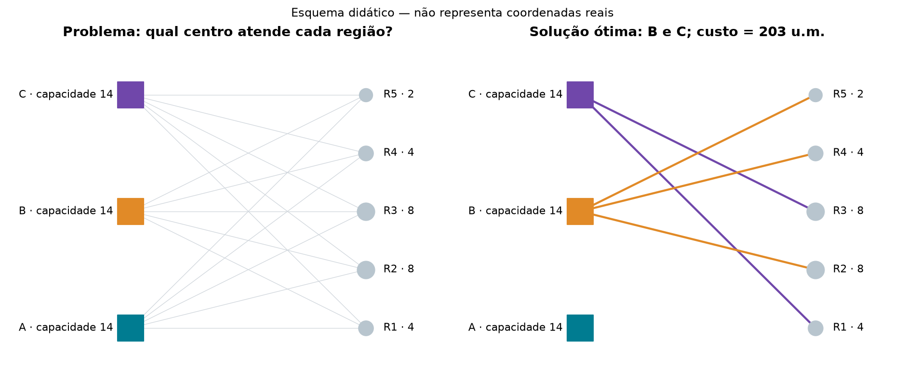
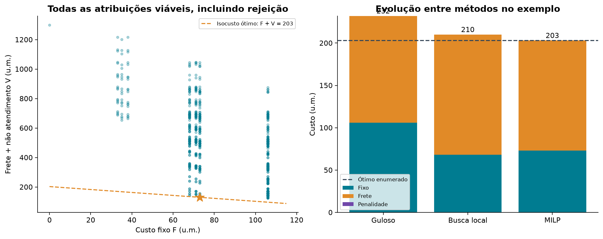
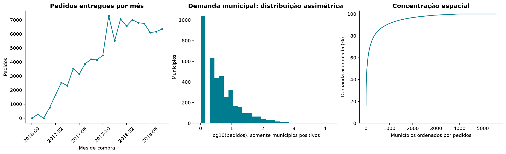
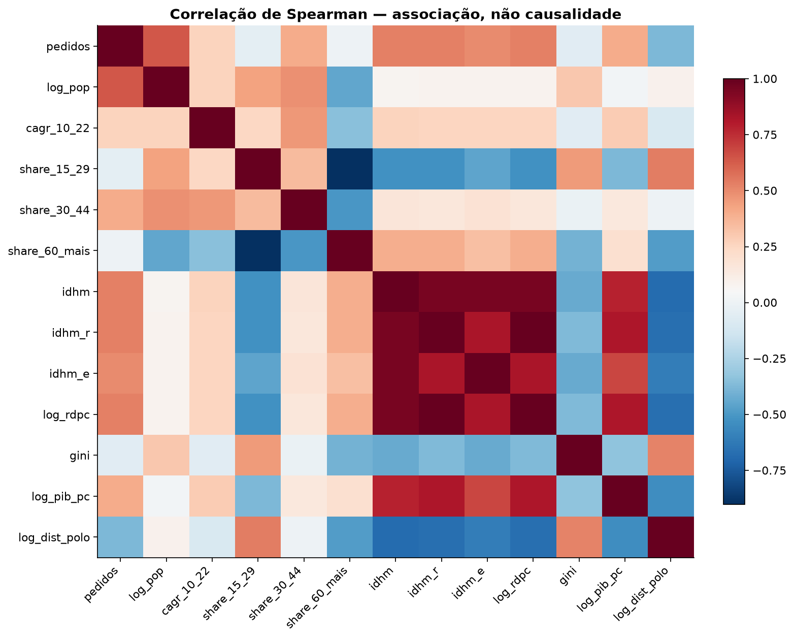
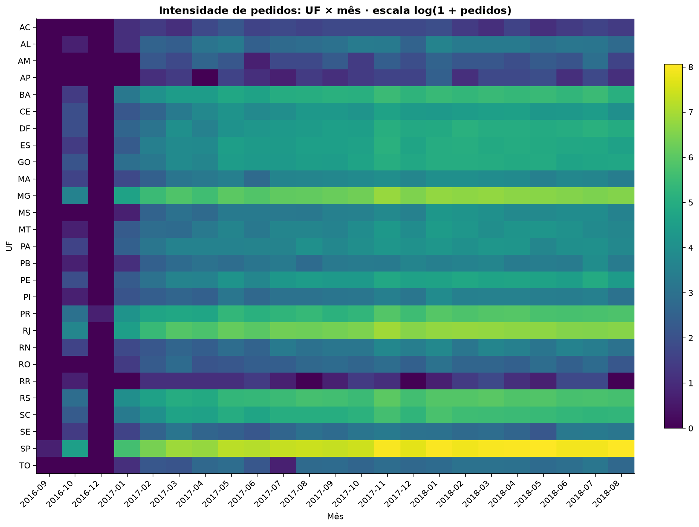
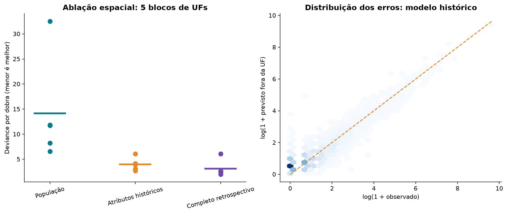
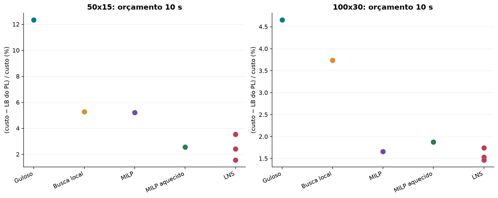
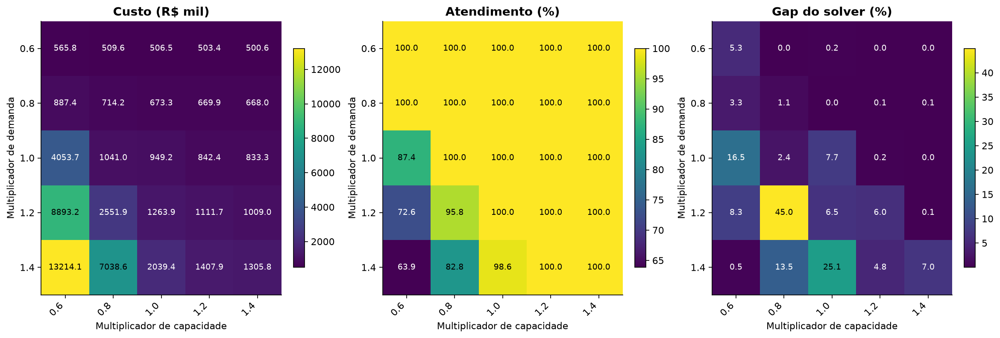
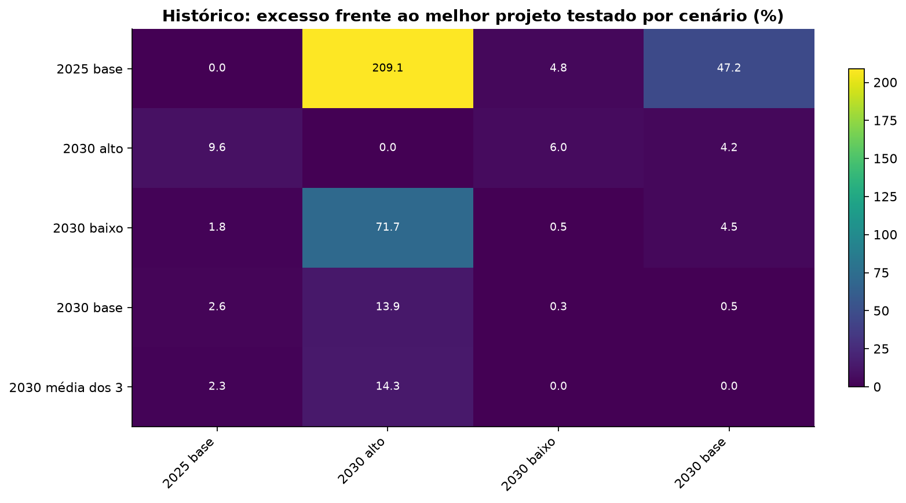

# Do contexto ao ótimo: estudo integrado

01/10/2026

## 1. Contexto

Uma rede de distribuição precisa aproximar a infraestrutura da demanda, sem abrir centros demais nem exceder sua capacidade. O projeto investiga essa decisão com geografia e pedidos do Olist, dados territoriais e cenários de custo. O objetivo deste estudo é tornar explícito o caminho entre dado, hipótese, decisão e evidência.

Há três níveis distintos: (1) um exemplo didático exato; (2) experimentos novos sobre recortes históricos do Olist; (3) resultados nacionais anteriores, baseados em demanda potencial e cenários. Não somamos nem comparamos diretamente custos desses níveis: têm escalas e horizontes diferentes.

O estado do projeto foi relido em 01/10/2026. A coleta territorial e os modelos de ML já existiam. Nesta rodada foram acrescentados o espaço completo de soluções, trajetórias reais do LNS, ablação temporal de atributos, análise exploratória gráfica e experimentos controlados com artefatos reproduzíveis.

## 2. Problema

Dados centros candidatos i e regiões j, escolher quais centros abrir e atribuir cada região a no máximo um centro. Cada centro tem capacidade Qᵢ e custo fixo fᵢ; cada região tem demanda dⱼ; transportar uma unidade custa cᵢⱼ. Demanda não atendida paga p por unidade. A decisão yᵢ é binária, assim como a atribuição xᵢⱼ.

Objetivo: minimizar Σᵢ fᵢyᵢ + Σᵢⱼ dⱼcᵢⱼxᵢⱼ + p Σⱼ dⱼ(1 − Σᵢxᵢⱼ). Restrições: Σᵢxᵢⱼ ≤ 1; Σⱼdⱼxᵢⱼ ≤ Qᵢyᵢ; xᵢⱼ ≤ yᵢ; x,y ∈ {0,1}.

Viabilidade matemática não significa atendimento integral: rejeitar pedidos é permitido nesta formulação. No estudo histórico, a penalidade representa demanda não atendida no horizonte; não existe backlog. Na rede nacional anterior, o mesmo termo foi interpretado como terceirização, uma hipótese distinta que exige capacidade e nível de serviço externos para aplicação operacional.

## 3. O que buscamos encontrar com as otimizações

Buscamos uma combinação de abertura, alocação e utilização que reduza o custo modelado, respeitando capacidade e explicando o atendimento. As saídas são: centros abertos, região atendida por cada centro, carga, custo fixo, frete, penalidade, atendimento e certificado ou limite de qualidade.

Ganho computacional é redução de objetivo nas mesmas premissas. Ganho econômico exige validar custos e operação real. O número de centros não deve ser minimizado isoladamente: fechar um centro pode aumentar frete ou rejeição. Também não basta observar um mapa mais compacto.

Para minimização, LB ≤ ótimo ≤ UB: UB é o custo de uma solução viável e LB vem da relaxação ou do solver. Este estudo usa gap = (UB − LB)/UB. O LP é um limite, não uma solução operacional e nem, necessariamente, o ótimo inteiro.

## 4. Visualização do ótimo em até três dimensões

O exemplo tem 3 centros, capacidade 14 por centro, 5 regiões e demanda total 26. São 4⁵ = 1.024 atribuições possíveis, contando não atendimento. Foram enumeradas todas: 760 são viáveis, das quais 126 atendem tudo. O custo mínimo é 203 unidades monetárias; MILP e enumeração concordaram.

Redução exata para mostrar o objetivo: F = custo fixo e V = frete + penalidade; custo = F + V. Cada ponto é uma solução calculada, e linhas de isocusto são retas. A projeção pode sobrepor decisões diferentes, por isso a prova vem da enumeração, não do desenho.

Na figura 3D os eixos são carga em A, carga em B e custo. Somente nesse gráfico filtramos atendimento completo; a carga em C é 26 − carga A − carga B. O ótimo global foi verificado também contra soluções com rejeição. Várias atribuições podem ter cargas iguais e custos diferentes; não existe uma superfície suave que autorize descida por gradiente.

A solução ótima abre B e C: B atende R2, R4 e R5 (carga 14); C atende R1 e R3 (carga 12); A fecha. Custo = 73 fixo + 130 de transporte = 203. Guloso = 232; busca local = 210. Essa sequência compara métodos; a trajetória temporal real aparece mais adiante.

No HTML, o simulador reenumera as 1.024 alternativas quando se muda demanda, capacidade ou custo fixo. Os controles são parâmetros do problema, não dimensões ocultas de uma superfície contínua.

## 5. Dados que contribuem para o problema

Olist fornece pedidos, datas, status, regiões de compradores e vendedores. IBGE/Ipeadata fornecem população, estrutura etária, renda, desenvolvimento e atividade econômica. ANTT e levantamento de aluguel informam componentes de cenários de custo; OSRM informa distâncias viárias na rede nacional anterior. Cada fonte responde a uma pergunta diferente.

Demanda, custos, capacidade e penalidade entram diretamente no otimizador. Idade, renda e população entram em modelos de distribuição da demanda; não são multiplicadores mágicos da função objetivo. OSM pode apoiar triagem de infraestrutura, mas existência de um objeto no mapa não comprova imóvel disponível, capacidade operacional ou preço.

Datas precisam permanecer visíveis: pedidos de 2016–2018, renda/IDHM de 2010 e atributos etários/crescimento até 2022. Usar 2022 para explicar 2017–2018 é análise retrospectiva; não é previsão disponível naquela época. Demanda nacional futura continua sendo cenário, não observação.

| fonte | papel | limite |
|---|---|---|
| Olist | Demanda histórica, sazonalidade e geografia | Marketplace específico; não mede todo o mercado |
| IBGE / Ipeadata | Exposição populacional e atributos territoriais | Datas e revisões diferentes; verificar disponibilidade na decisão |
| ANTT | Coeficientes para cenário de frete | Piso por viagem não é tarifa observada por pedido |
| Aluguel | Cenário de custo de área | Preço pedido; dimensão do imóvel precisa ser compatível |
| OSRM / OSM | Distância e infraestrutura mapeada | Perfil viário não garante acesso de caminhão ou disponibilidade |

## 6. Coleta, ajuste e validação dos dados

Reaproveitamos os dados brutos já coletados; não houve necessidade de repetir requisições externas. O ajuste reconstruiu séries mensais, juntou o painel municipal à tabela territorial com cardinalidade many-to-one, calculou ausências e correlações e preservou IDs. Os recortes novos de otimização usam compras entre janeiro/2017 e agosto/2018, explicitamente.

No bruto há 99.441 pedidos, 96.478 entregues e 0 IDs de pedido duplicados. A tabela territorial tem 5.571 municípios e 5.564 linhas completas para a ablação. 1.617 municípios não têm pedidos no painel de modelagem; isso não demonstra ausência de mercado.

A verificação de proveniência encontrou 319 metadados, dos quais 11 permitiram confrontar arquivo e SHA-256; divergências detectadas: 0. Registros sem arquivo/hash verificável ficam marcados, não são considerados aprovados. Novas coletas OSM estavam presentes no diretório; um registro sem payload identificável não foi usado como evidência de infraestrutura validada.

O relatório municipal de cobertura anterior informa 64 pedidos entregues sem município. Para CEP de três dígitos o pipeline é diferente: perdas e totais não devem ser comparados como se fossem a mesma transformação. A ablação usa a mesma amostra completa nos três modelos, evitando comparar modelos em populações diferentes.

Rastreabilidade: manifest.json registra versões, commit, parâmetros e hashes; cada solve salva assignment e cada instância tem snapshot NPZ. Resultados históricos importados são identificados como históricos. Hash íntegro atesta consistência do arquivo, não correção econômica ou representatividade da fonte.

## 7. Processamento exploratório: distribuição, concentração e mapas de calor

Os 300 municípios de maior volume concentram 77,91% dos pedidos do painel. A distribuição é muito assimétrica: olhar apenas média esconderia a cauda e os municípios sem observação. O histograma usa log10 para tornar a cauda legível; municípios zero são informados separadamente.

A série mensal mostra a evolução do volume observado, que mistura sazonalidade, crescimento e mudança de cobertura do marketplace. A intensidade UF×mês usa log(1+pedidos), não participação percentual. Não é uma previsão.

A matriz de Spearman mede associação monotônica. População e renda podem estar relacionadas com pedidos; correlação não prova que alterar renda causaria uma mudança de demanda. Variáveis territoriais correlacionadas também dificultam atribuir importância isolada.

## 8. As variáveis realmente ajudam a modelar o problema?

Nova ablação: baseline proporcional à população; GBM com população/renda/IDHM/Gini/PIB históricos; e GBM com o conjunto retrospectivo completo. Usamos os mesmos municípios e cinco dobras agrupadas por UF. Escala e modelo são ajustados somente no treino de cada dobra. Foram mantidos 150 ciclos e a mesma configuração para os dois GBMs, sem busca de hiperparâmetros no teste.

O conjunto histórico exclui crescimento 2010–2022, faixas etárias de 2022 e distância a polos derivados do período completo. Ainda é uma análise espacial contemporânea: datas de publicação do PIB/estimativas não foram reconstruídas para provar disponibilidade em tempo real. O resultado não é um backtest prospectivo de pedidos.

As métricas globais abaixo agregam todas as previsões fora da UF; os pontos no gráfico são métricas por dobra. Diferenças entre dobras não são intervalos de confiança independentes. Razão previsto/observado próxima de 1 indica calibração agregada, mas não elimina erro local.

Para saber se uma variável melhora a decisão, a etapa seguinte precisa alimentar a mesma instância e avaliar custos com capacidade física fixa. O experimento fatorial seguinte testa diretamente fatores de otimização; não confunde importância preditiva com valor econômico.

| modelo | deviance_global | MAE_pedidos | previsto_observado |
|---|---|---|---|
| populacao | 14,16 | 12,49 | 0,97 |
| historico | 3,98 | 6,23 | 0,95 |
| retrospectivo_completo | 3,14 | 5,42 | 0,91 |

## 9. Aplicação e comparação dos algoritmos

Executamos guloso, busca local, MILP frio, MILP aquecido e LNS em 50×15 e 100×30. O LNS usou três sementes e vizinhança 25; orçamento nominal de 10 s por execução, contando inicialização. Métodos rápidos podem encerrar antes. A relaxação linear foi calculada à parte como referência comum.

O orçamento do MILP passou a descontar construção e aquecimento antes de chamar o backend. O reparo do LNS passou a descontar construção do subproblema. Ambos usam uma thread de solver; overhead final e pequenos excessos continuam registrados. Uma rodada não estabelece superioridade universal nem é teste controlado de hardware.

O guloso ignora custo de abertura na escolha; busca local corrige parte dessa fraqueza. MILP combina incumbente e prova por bounds. LNS reotimiza subconjuntos e aceita melhorias; seus reparos podem encerrar sem prova de ótimo. O valor mostrado abaixo é simulado para a janela histórica inteira, não custo mensal de operação real.

Três sementes dão noção inicial de variação, não uma caracterização estatística definitiva. Comparações com os resultados antigos devem considerar a nova janela explícita, orçamento e instrumentação.

| instancia | metodo | execucoes | custo_medio | gap_medio_pct | tempo_medio_s | atendimento_pct |
|---|---|---|---|---|---|---|
| 50x15 | Guloso | 1 | 994.102,40 | 12,33 | 0,00 | 100,00 |
| 50x15 | Busca local | 1 | 920.006,98 | 5,27 | 0,02 | 100,00 |
| 50x15 | MILP | 1 | 919.471,41 | 5,21 | 9,66 | 100,00 |
| 50x15 | MILP aquecido | 1 | 894.531,26 | 2,57 | 9,76 | 100,00 |
| 50x15 | LNS | 3 | 893.976,56 | 2,50 | 10,23 | 100,00 |
| 100x30 | Guloso | 1 | 1.352.149,43 | 4,65 | 0,00 | 100,00 |
| 100x30 | Busca local | 1 | 1.339.302,12 | 3,74 | 0,12 | 100,00 |
| 100x30 | MILP | 1 | 1.310.952,57 | 1,66 | 9,80 | 100,00 |
| 100x30 | MILP aquecido | 1 | 1.313.883,90 | 1,88 | 9,92 | 100,00 |
| 100x30 | LNS | 3 | 1.309.923,03 | 1,58 | 10,10 | 100,00 |

## 10. Evolução da otimização e ponto que buscamos

O gráfico temporal registra o incumbente inicial e o custo após cada reparo efetivamente executado no LNS. Não foi criado interpolando resultados finais ou recomeçando o solver para cada tempo. Patamares indicam iterações sem melhoria; quedas indicam uma solução melhor aceita.

O alvo ideal é atingir o ótimo inteiro. Na instância grande ele só é conhecido quando há prova; o limite do LP delimita o espaço de melhora ainda possível. Encostar visualmente numa linha não certifica igualdade. No exemplo didático, o alvo 203 é conhecido porque todo o espaço foi enumerado.

## 11. Análise de comportamento e interação entre variáveis

A nova sensibilidade varia um fator por vez: demanda, capacidade, custo fixo, frete e penalidade. Demanda não recalcula capacidade; frete não recalcula penalidade. A instância-base é congelada. O custo é acompanhado de atendimento e intervalo computacional entre o bound do MILP e o incumbente.

Na grade 5×5, demanda e capacidade variam independentemente, com demais fatores fixos. O mapa de atendimento identifica regimes com falta de capacidade ou rejeição economicamente escolhida. Os mapas não são superfícies em que devemos escolher demanda menor para 'otimizar': demanda é cenário externo, não variável livre da decisão.

O maior gap de solver na grade foi 44,99%. As diferenças de custo menores que a incerteza computacional não sustentam uma conclusão precisa de efeito. Quantidade de centros é uma propriedade do incumbente e pode variar entre soluções quase equivalentes.

Uma previsão de aumento de demanda só indica necessidade de expansão quando testada contra capacidade instalada, custos e atendimento. A cadeia de análise passa a verificar esse elo diretamente, em vez de inferir robustez de uma rede que crescia junto com a demanda.

## 12. Visualização geográfica da solução

O mapa usa exatamente o assignment da melhor execução 50×15 desta rodada, método LNS. Os limites estaduais são do arquivo IBGE coletado; pontos são centroides das regiões de CEP e candidatos, não endereços de imóveis. As ligações são retas de atribuição, não rotas viárias.

A concentração dos pontos decorre também da seleção das regiões com mais pedidos. Portanto, o desenho não representa cobertura territorial nacional completa. Os círculos indicam volume; os triângulos indicam centros abertos. Avaliar acessibilidade e prazo exige matriz viária e regras do veículo adequadas ao caso de uso.

## 13. Rede nacional, previsão, cenários e scoring já existentes

Os resultados nacionais anteriores foram preservados e identificados como históricos. Eles combinam propensão estimada, população e hipóteses de participação/crescimento do mercado. O custo fixo inclui aluguel, mas ainda não todos os custos de operar um centro. A divisão de municípios grandes em zonas co-localizadas evita nós impossíveis de atender, ao preço de uma aproximação geográfica.

A matriz a seguir mede excesso frente ao melhor dos projetos testados em cada cenário. Não é arrependimento em relação ao ótimo desconhecido, nem demonstra ganho realizado em 2030. As avaliações de recurso são heurísticas: diferenças pequenas podem incluir erro de otimização.

O arquivo histórico reta×estrada reporta cerca de 1,27% de excesso para o projeto feito com reta quando ambos são avaliados com estrada. É evidência de sensibilidade da decisão naquele experimento, não um multiplicador universal. O scoring tem repetições por semente; comparar filtros requer controlar o orçamento e considerar o conjunto completo como referência heurística.

Há 21 registros de scoring com sementes no arquivo existente. A previsão populacional tem validações próprias, mas a transferência população→pedidos é hipótese adicional. O experimento histórico previsão→decisão usa covariáveis e propensão retrospectivas: não certifica uma decisão integralmente implementável com informação disponível antes de 2022.

Não refiz essas rodadas nacionais longas: já existem resultados para o processo pedido, e a prioridade foi executar os elos ausentes e tornar sua interpretação verificável. Para aplicação real, repetir com snapshots temporais, custos operacionais, SLA e bounds de recurso.

## 14. Explicação geral e conclusão

O processo completo passa a ser: definir decisão e horizonte → coletar/preservar fontes → ajustar e validar → explorar distribuição e associações → testar contribuição preditiva → construir instância com unidades explícitas → otimizar → avaliar independentemente → comparar sob protocolo declarado → testar sensibilidade e cenários → comunicar solução e limites.

As melhorias implementadas permitem ver por que o custo cai, quando a capacidade passa a limitar o atendimento e que parte da capacidade preditiva depende de atributos posteriores. Não é necessário que todo teste favoreça o modelo mais complexo: um baseline melhor em algum recorte é informação útil.

O próximo salto de maturidade depende de três validações externas: capacidade operacional por período; custo de instalações compatíveis com a área; tarifa e nível de serviço reais. A análise atual demonstra funcionamento computacional e comportamento sob hipóteses, sem prometer uma economia operacional ainda não medida.

## 15. Reprodutibilidade e arquivos de evidência

Execução nova: estudo_integrado_20261001. Commit-base: 0a4bc5f1433d0046cf70ec358b97fb7d213c3fba. Python de análise: 3.12.10. As mudanças desta rodada são identificadas também pelos hashes do código; o commit-base sozinho não representa o estado modificado.

Rodar análise no ambiente do projeto: python -m alocacao_capacitada.analysis.study --out results/uma_pasta_nova. Rodar renderização com Matplotlib: python scripts/render_study.py --data results/uma_pasta_nova --out docs/estudo_integrado. O módulo impede sobrescrever uma execução existente.

Arquivos principais: qualidade.json, proveniencia.csv, dados_municipais.csv, correlacao_spearman.csv, ablacao_metricas.csv, ablacao_previsoes.csv, espaco_exato.csv, comparacao.csv, trajetoria_lns.csv, sensibilidade_controlada.csv, interacao_demanda_capacidade.csv, manifest.json, snapshots NPZ e assignments NPY. Figuras têm versões PNG e SVG.

Fontes primárias dos dados permanecem nos metadados de coleta do projeto. Olist: https://www.kaggle.com/datasets/olistbr/brazilian-ecommerce; IBGE: https://www.ibge.gov.br/; ANTT: https://www.gov.br/antt/; OSRM: https://project-osrm.org/. Os gráficos geográficos atribuem limites ao IBGE. Não houve nova verificação de vigência tarifária nesta rodada.
