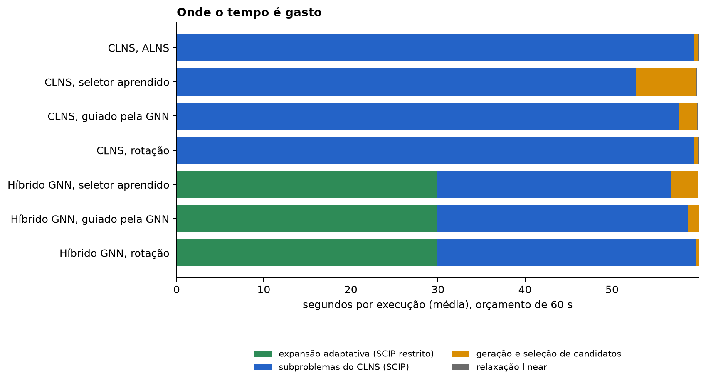

# Relatório geral da linha de pesquisa — *Learning the Search Space* no SSCFLP

*Atualizado em 04/10/2026. Autor: Jean Michael Estevez Alvarez.*

Este relatório reúne, em um só lugar, o que foi feito na linha de pesquisa: o problema modelado,
os dados, cada direção tomada, o que foi medido, o que foi descartado e por quê, e o que falta.
Os relatórios por frente (`02` a `08` nesta pasta) trazem o detalhe de cada etapa; o manuscrito
em `paper/` traz a versão formal, com as demonstrações.

**Regra de leitura dos números.** Todo número deste relatório vem de uma execução registrada em
`results/pesquisa/`, com manifesto e hash dos dados. Resultados de piloto usam instâncias de
**validação** e estão rotulados como piloto. O **teste fechado** (instâncias de teste, corredor,
escala, Holmberg e Olist) ainda não foi executado; nenhuma afirmação aqui depende dele.

---

## 1. Resumo

| Pergunta | Resposta medida |
|---|---|
| Aprender a **podar** centros acelera o SSCFLP com segurança? | Não. Para manter a melhor solução em 80% das instâncias é preciso ficar com cerca de 80% dos centros, com qualquer ranqueador. O ranking da relaxação linear, sem treino, é igual ou melhor que a GNN entre ρ = 0,2 e 0,7. |
| Decompor por clusters funciona? | Só com coordenação. Sem ela, a união dos subproblemas violou a capacidade em todas as instâncias examinadas. Com capacidade residual e custo fixo pago uma vez (CLNS), toda solução aceita é viável. |
| O que dá o melhor resultado até aqui? | Expansão adaptativa (resolver subconjuntos crescentes de centros, com certificado de custo reduzido), sozinha ou seguida de CLNS: desvio final mediano de 0,17% a 0,87%, contra 2,4% a 2,7% do SCIP no modelo completo em 60 s, e integral primal cerca de 3 vezes menor. |
| O aprendizado é o responsável pelo ganho? | Nos pilotos, não. Trocar a GNN pelo ranking da relaxação linear não piorou nenhum método (integral primal 0,0192 contra 0,0240 na expansão; diferença não significativa em 16 instâncias), e o seletor aprendido não se separou da rotação. |
| Por que o seletor importa pouco? | 54% a 58% dos subproblemas escolhidos pelo CLNS eram repetições de subproblemas que já tinham falhado. A busca é limitada pelo alcance das vizinhanças, não pela ordem em que são tentadas. |
| As frentes da literatura se reproduzem? | Parcialmente. Em cinco reconstruções, a heurística clássica de mesma função capturou a maior parte do ganho atribuído ao aprendizado. |


*Figura 1. As seis etapas, na ordem em que aconteceram. Cada caixa traz o que foi feito, o que
foi medido e a decisão que levou à etapa seguinte. Vermelho marca caminhos descartados com base
em medição; verde, resultado positivo; azul, a etapa mais recente.*

---

## 2. O problema que está sendo modelado

**SSCFLP estrito** (localização capacitada com fonte única). Dado um conjunto de centros
candidatos `I` (m centros) e de clientes `J` (n clientes):

- abrir o centro `i` custa `f_i` e dá capacidade `Q_i`;
- o cliente `j` tem demanda `d_j` e deve ser atendido **inteiro por um único centro**;
- atender `j` a partir de `i` custa `c_ij` (custo **total** do par, não por unidade).

```
min   Σ_i f_i·y_i + Σ_i Σ_j c_ij·x_ij
s.a.  Σ_i x_ij = 1                 para todo cliente j      (cada cliente em um centro)
      Σ_j d_j·x_ij ≤ Q_i·y_i       para todo centro i       (capacidade; fechado não atende)
      x_ij ≤ y_i                   para todo par (i, j)     (reforça a relaxação linear)
      x_ij, y_i ∈ {0, 1}
```

Não há variável de demanda não atendida: todo cliente tem de ser alocado.

**Por que é difícil na prática.** Com 30 centros e 150 clientes, o SCIP 10 em uma thread não
prova o ótimo em 60 s; o gap certificado fica entre 1,8% e 3,6%. A relaxação linear forte deixa
1,6% a 4,4% quando o custo fixo domina. Com 50 × 200, o gap certificado chegou a 15,6%.

**Acoplamento de capacidade.** É a propriedade que governa todas as decisões desta pesquisa.


*Figura 2. À esquerda, dois grupos de clientes resolvidos em separado enviam 60 unidades cada um
ao mesmo centro de capacidade 100: cada subproblema é viável, a união não é, e o custo fixo do
centro aparece duas vezes na soma dos objetivos. À direita, o que o CLNS faz: o grupo fixo mantém
suas 60 unidades, o grupo livre enxerga só as 40 restantes e não paga de novo o custo fixo.*

**Duais e custos reduzidos.** A relaxação linear forte é resolvida uma única vez (HiGHS). Dela
saem o limite inferior `L` e dois custos reduzidos usados em todo o resto:

- `r_i`, do centro `i`: a parte do custo fixo que a disposição a pagar dos clientes não cobre.
  Serve para **certificar** que um centro podado não melhora a solução atual: se `L + r_i ≥ U`
  (U = custo da solução atual), nenhuma solução que abra `i` é melhor que `U`.
- `c̄_ij`, do par `(i, j)`: quanto o par custa a mais do que a relaxação aceita pagar, já
  descontados capacidade e rateio do custo fixo. Serve como **regret**: clientes cuja alocação
  atual tem `c̄` alto são candidatos a reotimização.

Uma armadilha encontrada no caminho: `c_ij − u_j` (só o dual da linha de atendimento) **não**
serve como regret. Ele é sempre negativo, porque `u_j` embute o rateio do custo fixo. A primeira
versão do seletor usava essa quantidade e os rótulos tiveram de ser coletados de novo.

---

## 3. Dados

| Conjunto | Tamanho (m × n) | Instâncias | Referência de qualidade | Uso |
|---|---|---:|---|---|
| Treino | 30 × 150 | 160 | pool SCIP 60 s + LNS 30 s | treino da GNN e do seletor |
| Validação | 30 × 150 | 32 | idem | escolhas de parâmetros e pilotos |
| Teste | 30 × 150 | 32 | idem | teste fechado (pendente) |
| Corredor | 30 × 150 | 16 | idem | família espacial nunca vista |
| Escala | 50 × 200 | 16 | SCIP 120 s + LNS 60 s | tamanho maior |
| Holmberg | 10–30 × 50–200 | 71 | ótimo publicado | âncora externa |
| Olist | 30 × 150 a 150 × 850 | 4 | SCIP 300 s + LNS 120 s | dados reais |

**Gerador sintético.** Adaptação de Cornuéjols, Sridharan e Thizy (1991), a mesma família
`facilities` usada por Gasse et al. (2019), para fonte única: demanda `U(5, 35)`; capacidade
`U(10, 160)` reescalada para razão capacidade/demanda de 1,5 ou 3,0; custo fixo
`U(0, 90) + U(100, 110)·√Q_i`; custo de atendimento `10 · distância · d_j`. Três famílias
espaciais: uniforme, clusters (mistura gaussiana) e corredor (pontos ao longo de segmentos). O
corredor nunca entra em treino nem em validação. Instâncias inviáveis sob fonte única são
rejeitadas por um teste first-fit-decreasing seguido, se preciso, de um MILP de viabilidade.

**Holmberg.** 71 instâncias com ótimo publicado (Holmberg, Rönnqvist e Yuan, 1999), custos não
euclidianos.

**Olist.** Pedidos entregues agregados por prefixo de CEP de três dígitos, frete pelo piso mínimo
da ANTT. Capacidades e custos fixos são premissas declaradas.

**Congelamento.** Instâncias e modelos têm hash SHA-256 em `data/frozen/LOCK.json`. O executor
confere a trava antes de cada rodada e grava o hash agregado no manifesto.

---

## 4. Como os números são obtidos

1. **Orçamento igual de tempo de parede** para todos os métodos (60 s em 30 × 150), incluindo
   atributos, inferência, PL, reparo, montagem do modelo, solução e validação, sob um relógio único.
2. **Isolamento**: cada execução fixada em um núcleo físico, um núcleo livre para o sistema,
   bibliotecas numéricas em uma thread, importações e modelos aquecidos fora do cronômetro.
3. **Dois relógios**: parede e CPU. A razão CPU ÷ parede abaixo de 0,9 marca suspeita de
   contenção; a execução é mantida e sinalizada.
4. **Validação independente**: toda solução devolvida é recalculada a partir dos dados originais
   (atribuição, capacidade, custo).
5. **Sementes**: três para métodos estocásticos, uma para determinísticos; as sementes são
   agregadas por instância **antes** de qualquer estatística entre instâncias.
6. **Registro**: manifesto com configuração e hashes; cada execução em SQLite com chave
   (instância, método, semente), o que permite retomar sem duplicar.

**Métrica principal: integral primal.** Seja `z(t)` o melhor custo encontrado até o instante `t`
e `z_BKS` o melhor custo conhecido da instância (mínimo entre todos os métodos e o rótulo).

```
g(t) = min{ 1, (z(t) − z_BKS) / z_BKS }        (g = 1 antes da primeira solução)
P    = (1/T) · ∫₀ᵀ g(t) dt                      (entre 0 e 1; menor é melhor)
```

`P = 0` significa ter a melhor solução desde o início; `P = 1`, nenhuma solução no orçamento. Um
método que encontra a primeira solução, a 1% do melhor, aos 6 s e para ali tem
`P = 0,1 × 1 + 0,9 × 0,01 = 0,109`. A integral premia achar boas soluções **cedo**; o desvio
final sozinho não separa um método bom aos 5 s de um bom aos 55 s.

**Métricas secundárias.** Desvio final `g(T)`; parcela de instâncias a até 1% e a até 0,1% do
melhor; vitórias, empates e derrotas pareadas; taxa de repetição de subproblemas; razão
CPU ÷ parede. Comparações pareadas por instância (Wilcoxon) com correção de Holm; intervalos de
confiança por bootstrap sobre instâncias (4.000 reamostragens).

**A auditoria.** A primeira versão do executor foi auditada e três erros de medição foram
corrigidos antes dos resultados relatados aqui: tempo de montagem contado duas vezes nas
trajetórias, integral primal sem o mínimo acumulado entre estágios e ausência de prazo global.
Uma segunda auditoria, no CLNS, corrigiu orçamento de subproblema, índices inválidos, custos
zerados e distâncias sem tensor (`08-auditoria-clns-20261003.md`). O piloto 2 foi executado
antes dessa segunda correção; o piloto 3 já roda com o código corrigido e repete os métodos
principais.


*Figura 3. Histograma da razão entre tempo de CPU e tempo de parede nas 432 execuções do
piloto 2, em faixas de 0,01. Valor 1,0 significa que o processo nunca esperou pelo processador.
A linha tracejada marca o limite de 0,9. Mediana 0,996; três execuções abaixo do limite.*

---

## 5. Etapa 1 — reconstruções da literatura

Cinco frentes do pacote *Learning the Search Space* foram reconstruídas em SCIP 10 e PyTorch em
CPU. São reconstruções metodológicas, não reproduções do código original.


*Figura 4. (a) Tempo até o ótimo por regra de branching, média geométrica deslocada em 1 s,
20 instâncias `facilities` 100 × 100; a regra aprendida (azul) empata com `pscost`. (b) Filtro de
trocas no p-mediana com n = 1000: cada ponto é uma configuração; para a direita é mais rápido,
para baixo perde menos qualidade; quadrados vazados têm busca completa ao final. (c) Localização
uniforme: custo dividido pela referência em função do número de pontos; a faixa cinza marca os
tamanhos de treino; faixas coloridas são os decis 10 a 90. (d) Localização-roteamento: desvio do
custo em relação à melhor solução conhecida; barra é a média, traço é a mediana.*

| Frente | Artigo | O que foi medido | Leitura |
|---|---|---|---|
| Branching aprendido | Gasse et al. 2019; Gupta et al. 2020 | Regra aprendida 91,7 s; `pscost` 93,2 s; `relpscost` 100,1 s; `fullstrong` 107,4 s. Acurácia de imitação 36%, igual à de "mais fracionária" (39%). | Mais rápida que o padrão (p = 0,021), indistinguível de `pscost` (p = 0,93). O SCIP 10 fecha a maior parte de `facilities` na raiz. |
| Trocas guiadas | Guo et al. 2023; Su et al. 2024 | Filtro clássico por ganho de adição: 47× mais rápido com 6,6% de perda. | A aceleração vem do filtro, não do aprendizado; o filtro aprendido é mais lento por causa da inferência. |
| Localização uniforme | Qian et al. 2026 | MPNN 1,026 contra 1,186 do Mettu–Plaxton em n = 1000. | Generaliza na escala; 3 de 4 sementes colapsaram antes da estabilização; com busca local, empata com o clássico. |
| Rede neural no MIP | Kaleem et al. 2024 | Aproximação contínua: mediana 0,03%; variantes neurais 0,05% a 0,30% (médias na figura). | O MIP com Deep Sets por big-M não otimiza em solver aberto (gap de 591% na primeira versão). |
| Multiobjetivo urbano | Wang, Cao e Huang 2026 | Não testado. | Texto completo não acessado. |

**Achado transversal.** O baseline que importa é o equivalente clássico, não o solver cru.
Comparar um método aprendido só com "SCIP completo" superestima a contribuição do aprendizado.

---

## 6. Etapa 2 — poda por ranking de centros

Uma GNN bipartida (centros e clientes, três rodadas de passagem de mensagem com arestas
condicionadas, dimensão 64) dá uma nota a cada centro. O rótulo é a frequência com que o centro
aparece aberto no conjunto de soluções a até 1% da melhor, o que tolera ótimos alternativos.


*Figura 5. Eixo horizontal: fração de centros mantida antes do reparo de viabilidade. Eixo
vertical: percentual das 32 instâncias de validação em que **todos** os centros da melhor solução
conhecida continuam disponíveis depois da poda. A linha tracejada é a meta pré-registrada de 80%.
O reparo de viabilidade (empacotamento first-fit-decreasing e cobertura local) sozinho mantém
pelo menos 41% dos centros, então ρ pequeno não significa problema pequeno.*

- A GNN ordena melhor que a heurística clássica (AUC 0,947 a 0,950 contra 0,905).
- Isso **não** vira poda segura: para conter a melhor solução em 80% das instâncias, GNN e PL
  precisam manter cerca de 80% dos centros.
- O ranking da relaxação linear, que não tem treino, fica acima da GNN entre ρ = 0,2 e 0,7.

**Decisão.** Poda é irreversível e precisa de folga para cada restrição de capacidade. A
informação do ranking passou a ser usada para decidir **onde procurar primeiro**, com o domínio
completo sempre alcançável: a expansão adaptativa.

**Expansão adaptativa.** Resolve o problema restrito aos 20%, 40%, 60% e 100% melhores centros,
reaproveitando a solução do estágio anterior. Para antes do fim se o estágio foi resolvido à
otimalidade e `L + r_i ≥ U` para todo centro podado: nesse caso `U` é o ótimo global,
**provado**, com só uma fração dos centros no solver.

---

## 7. Etapa 3 — decomposição por clusters e CLNS

**Decomposição ingênua.** Clientes agrupados por k-means sobre o perfil de custo unitário (como
cada cliente "enxerga" os preços dos centros), cada grupo resolvido em separado. Resultado: união
inviável em todas as instâncias examinadas (690 a 1.070 unidades de sobrecarga) e, depois de um
reparo guloso, 19% a 29% acima da referência.

**CLNS (LNS orientado por clusters).** A cada iteração, um subconjunto `F` de clientes fica livre
e o restante fica **fixo**. O subproblema:

- usa a capacidade **residual** `Q_i − (carga dos clientes fixos em i)`;
- não tem variável de abertura (nem custo fixo) para centros que já atendem clientes fixos;
- limita cada cliente livre aos seus 10 centros mais baratos mais o atual;
- parte da solução atual e tem limite curto de tempo (0,5 s, crescendo até 3× após falhas).

Com isso, toda solução aceita é viável no problema inteiro e a melhora do subproblema é igual à
melhora do objetivo global (Proposição 2 do manuscrito).

**Cinco tipos de subproblema:** *interior* (um cluster), *fronteira* (dois clusters vizinhos),
*liberação* (clientes de um centro caro por unidade de carga e de centros parecidos; é o
movimento que consegue **fechar** um centro), *regret* (vizinhos do cliente com maior custo
reduzido na alocação atual) e *abertura* (clientes mais baratos de um centro fechado bem
ranqueado).

**Seletores:** rotação entre tipos; ALNS (roleta com pesos adaptativos, Ropke e Pisinger 2006);
dual (maior regret); aprendido (LightGBM que prevê ganho por segundo, treinado com rótulos fora
da política: 8 candidatos resolvidos a partir do mesmo estado; 23.840 rótulos de treino,
AUC 0,76); guiado pela GNN (ataca onde a solução atual mais discorda do ranking).

**Piloto 1** (16 instâncias de validação, uma semente): CLNS com integral primal de 0,024 a
0,041, contra 0,062 a 0,074 de LNS e SCIP, mas estacionando a 1,2% a 2,7% do melhor. A expansão
adaptativa teve 0,020 e 0,3%. O seletor aprendido foi o melhor do CLNS, sem se separar da rotação
(p = 0,43). A decomposição ingênua ficou em 0,497 e 28,8%.

---

## 8. Etapa 4 — o híbrido (piloto 2)


*Figura 6. O método híbrido. A relaxação linear é resolvida uma vez e seus duais são
reaproveitados pela expansão (certificado) e pelo CLNS (regret). A fração α = 0,5 do orçamento
foi fixada antes dos experimentos, sem ajuste.*

**Hipóteses pré-registradas.** H-a: o híbrido com seletor GNN tem integral primal menor que a
expansão adaptativa sozinha. H-b: dentro do híbrido, o seletor guiado pela GNN supera rotação e
aprendido.

**Piloto 2:** 16 instâncias de validação, três sementes, 432 execuções, protocolo de tempo v3.


*Figura 7. Esquerda: integral primal média por método; o traço é o intervalo de confiança de 95%
por bootstrap sobre instâncias; traços que se sobrepõem indicam métodos que o piloto não consegue
ordenar. Direita: desvio final mediano, em percentual, ao fim dos 60 s. Azul marca os métodos com
algum componente aprendido.*

| Método | Integral primal (IC 95%) | Desvio final | Até 1% | Até 0,1% |
|---|---|---:|---:|---:|
| Expansão adaptativa (GNN) | 0,0257 (0,019–0,035) | 0,81% | 62,5% | 12,5% |
| Híbrido, seletor aprendido | 0,0270 (0,020–0,036) | 0,57% | 87,5% | 6,3% |
| Híbrido, rotação | 0,0274 (0,021–0,035) | 0,63% | 62,5% | 18,8% |
| CLNS, seletor aprendido | 0,0292 (0,023–0,036) | 2,12% | 12,5% | 0,0% |
| Híbrido, guiado pela GNN | 0,0296 (0,022–0,040) | 0,62% | 68,8% | 12,5% |
| CLNS, ALNS | 0,0337 (0,029–0,038) | 2,40% | 12,5% | 0,0% |
| CLNS, rotação | 0,0359 (0,030–0,043) | 2,31% | 18,8% | 0,0% |
| CLNS, guiado pela GNN | 0,0423 (0,034–0,051) | 1,88% | 0,0% | 0,0% |
| LNS | 0,0700 (0,059–0,082) | 1,82% | 12,5% | 0,0% |
| SCIP com partida do LNS | 0,0705 (0,059–0,084) | 3,59% | 25,0% | 0,0% |
| SCIP (modelo completo) | 0,0795 (0,067–0,091) | 2,66% | 18,8% | 12,5% |


*Figura 8. Para cada segundo do orçamento, a mediana entre instâncias do gap à melhor solução
conhecida, em escala logarítmica. Uma curva que cai cedo tem integral primal pequena; uma curva
que continua caindo tarde tem desvio final pequeno. Híbrido (azul) e expansão (verde) coincidem
até os 30 s, porque o híbrido gasta metade do orçamento na expansão.*


*Figura 9. Esquerda: percentual de instâncias que terminam a até 1% do melhor. Direita: em
quantas das 16 instâncias cada método termina melhor, igual ou pior que o SCIP no modelo
completo; essa visão não depende do tamanho das diferenças.*



*Figura 10. Decomposição do tempo de uma execução, em média. O seletor aprendido gasta de 3 a
7 s em geração de candidatos e inferência; os demais, menos de 2,5 s.*

**Leitura.**

- **H-a não se confirmou.** A expansão sozinha tem a menor integral primal; os híbridos ficam
  dentro do intervalo dela. O que o híbrido muda é o fim: 0,57% a 0,63% de desvio contra 0,81%,
  e até 87,5% das instâncias a 1% do melhor contra 62,5%.
- **H-b não se confirmou.** O seletor guiado pela GNN (0,0296) não supera rotação (0,0274) nem
  aprendido (0,0270).
- Todo método que restringe o espaço de busca fica 2 a 3 vezes abaixo do SCIP completo em
  integral primal. Os híbridos vencem o SCIP em 13 a 14 de 16 instâncias.
- CLNS sem a expansão estaciona perto de 2% com qualquer seletor.

---

## 9. Etapa 5 — o aprendizado é necessário? Controles clássicos e memória (piloto 3)

A revisão crítica da direção ("estamos usando algoritmos que não seriam para essa finalidade")
levou a um plano em cinco passos. Os dois primeiros estão implementados e medidos aqui.

**Passo 1 — controles sem aprendizado.**

- **Kernel Search** (Guastaroba e Speranza, 2014): núcleo = centros com `y > 0` no PL; os demais
  em baldes por custo reduzido crescente; resolve núcleo e depois núcleo + balde, promovendo ao
  núcleo os centros do balde que a nova solução usa.
- **Expansão adaptativa ordenada pelo PL**: o mesmo algoritmo da seção 6, com
  `score_i = y_i − 0,001 · r_i / max|r|` no lugar da GNN.
- **Híbrido PL**: expansão ordenada pelo PL + CLNS com rotação. Nenhum componente aprendido.

**Passo 2 — memória de subproblemas.** Um LNS que só aceita melhora pode escolher várias vezes o
mesmo subproblema a partir de uma vizinhança que não mudou. O subproblema depende do estado só
por três coisas: o conjunto livre `F`, os centros atuais dos clientes de `F` e a carga fixa por
centro. A chave é um hash de 96 bits dessas três coisas; uma tabela guarda, por chave, o maior
limite de tempo com que o subproblema já falhou. Com a memória ligada, candidatos já esgotados
com limite igual ou maior saem da lista antes da seleção. É a tabela de transposição da busca em
árvore aplicada a vizinhanças: não muda o que é alcançável, só evita pagar duas vezes pela mesma
resposta negativa. Com a memória desligada, a chave é calculada só para **medir** a repetição.

**Piloto 3:** as mesmas 16 instâncias de validação, 60 s, três sementes, 352 execuções, já com
o código do CLNS corrigido pela segunda auditoria. Repete SCIP, expansão com GNN, CLNS e híbrido
com rotação, e acrescenta os controles sem aprendizado e a memória.


*Esquerda: integral primal média com intervalo de confiança de 95%. Direita: desvio final
mediano. Azul marca os métodos que usam a GNN; cinza, os que não usam nenhum componente
treinado. "PL" é o ranking tirado da relaxação linear.*

| Método | Aprende? | Integral primal (IC 95%) | Desvio final | Até 1% | Até 0,1% |
|---|:---:|---|---:|---:|---:|
| Expansão adaptativa (PL) | não | 0,0192 (0,015–0,024) | 0,17% | 56,3% | 43,8% |
| Híbrido PL, rotação | não | 0,0215 (0,017–0,026) | 0,53% | 75,0% | 18,8% |
| Híbrido PL, rotação + memória | não | 0,0217 (0,017–0,027) | 0,59% | 87,5% | 18,8% |
| Híbrido GNN, rotação | sim | 0,0236 (0,019–0,028) | 0,87% | 68,8% | 12,5% |
| Híbrido GNN, rotação + memória | sim | 0,0238 (0,019–0,029) | 0,87% | 68,8% | 12,5% |
| Expansão adaptativa (GNN) | sim | 0,0240 (0,018–0,030) | 0,93% | 50,0% | 12,5% |
| Kernel Search | não | 0,0258 (0,019–0,033) | 0,99% | 56,3% | 12,5% |
| CLNS, rotação + memória | não | 0,0347 (0,031–0,039) | 2,36% | 0,0% | 0,0% |
| CLNS, rotação | não | 0,0372 (0,032–0,043) | 2,80% | 0,0% | 0,0% |
| SCIP (modelo completo) | não | 0,0706 (0,060–0,081) | 2,44% | 18,8% | 6,3% |


*Gap mediano à melhor solução conhecida a cada segundo, em escala logarítmica. Linhas
tracejadas são as variantes ordenadas pelo PL; contínuas, pela GNN.*

**A GNN não foi necessária.** Trocar a GNN pelo ranking do PL, que não precisa de dados de
treino, não piorou nenhum método e melhorou numericamente todos:

- expansão adaptativa: integral 0,0192 com PL contra 0,0240 com GNN; desvio final 0,17% contra
  0,93%; o PL tem a menor integral em 11 das 16 instâncias (Wilcoxon pareado, p = 0,13);
- híbrido: 0,0215 contra 0,0236; menor em 10 de 16 (p = 0,43).

Com 16 instâncias nenhuma dessas diferenças é significativa. A afirmação que se sustenta é a
mais fraca: **não há evidência de que o ranking aprendido ajude**, e as estimativas pontuais
favorecem o ranking sem aprendizado. O Kernel Search, o método clássico estabelecido, fica no
nível da expansão com GNN e vence o SCIP completo em 14 de 16 instâncias. O certificado de custo
reduzido fechou 1 das 16 instâncias antes do último estágio, com os dois rankings.

**O que a fase de CLNS acrescenta.** Com o ranking do PL, o híbrido não melhora a integral da
expansão sozinha (0,0215 contra 0,0192; p = 0,40). No fim da execução o efeito é misto: mais
instâncias terminam a até 1% (75,0% contra 56,3%), mas menos chegam a 0,1% (18,8% contra 43,8%).
A expansão com o orçamento inteiro fecha ou quase fecha as instâncias mais fáceis; o híbrido,
que interrompe a expansão na metade, troca isso por resultados mais estáveis nas difíceis. A
fração α passa a ser uma ablação necessária.


*Esquerda: percentual das iterações em que o subproblema escolhido já tinha falhado a partir do
mesmo estado local com limite de tempo igual ou maior. Direita: subproblemas resolvidos por
execução. Verde marca as variantes com memória.*

**Repetição e memória.** Sem memória, **54% a 58% dos subproblemas escolhidos pelo CLNS eram
repetições**: mais da metade das iterações resolveu de novo um modelo cuja resposta já era
conhecida. A memória elimina cerca de metade delas; os 25% a 27% restantes são iterações em que
**todos** os candidatos estavam esgotados, isto é, a solução era um ótimo local das cinco
vizinhanças naquele limite de tempo. O tempo liberado não virou ganho mensurável: no CLNS
sozinho a integral foi de 0,0372 para 0,0347 (p = 0,18) e o desvio de 2,80% para 2,36%
(p = 0,12); dentro dos híbridos, nenhuma mudança.

**Leitura conjunta.** O CLNS é limitado pelo **alcance** das vizinhanças, não pela ordem em que
são tentadas. Isso explica por que nenhum seletor, aprendido ou não, se separou da rotação nos
pilotos anteriores. O ganho sobre o SCIP completo vem dos mecanismos (restrição aninhada com
certificado e subproblemas coordenados), e não do aprendizado.

**Medição.** Mediana da razão CPU ÷ parede de 0,999; 7 das 352 execuções (2,0%) abaixo de 0,9,
todas no mesmo núcleo, que dividiu tempo com outras tarefas da máquina durante a rodada; estouro
de orçamento com percentil 95 de 0,04 s.


---

## 10. O que foi implementado

| Componente | Arquivo | Conteúdo |
|---|---|---|
| Modelo e validador | `pesquisa/problema.py`, `exato.py` | SSCFLP em SCIP (API matricial), PL forte em HiGHS com duais e custos reduzidos, validação independente |
| Gerador e dados | `geradores.py`, `dados.py`, `holmberg_split.py`, `olist_split.py` | famílias sintéticas, leitura de Holmberg e Olist, rótulos com pool de soluções |
| Ranqueadores | `atributos.py`, `aprendizado.py` | grafo bipartido, GNN, LightGBM, MLP |
| Políticas guiadas | `hibrido.py` | top-k, expansão adaptativa com certificado, warm start, prioridade de branching, redução clássica, Kernel Search |
| Decomposição | `decomposicao.py`, `clns.py` | k-means por perfil de custo, subproblema com capacidade residual, cinco tipos de candidato, seis seletores, memória de subproblemas |
| Experimentos | `etapa1.py`, `exp_clns.py` | executores com registro, retomada e manifesto |
| Medição | `medicao.py`, `congelar.py`, `registro.py`, `tempos.py` | afinidade de núcleo, dois relógios, trava de dados, SQLite |
| Reconstruções | `l2b.py`, `swap.py`, `unifl.py`, `lrp.py` e `exp_*.py` | as cinco frentes da seção 5 |
| Análise | `analise.py`, `scripts/agregados_clns.py`, `scripts/figuras_pesquisa.py`, `paper/figuras/gerar_figuras.py` | integral primal, bootstrap, testes pareados, figuras |
| Testes | `tests/test_pesquisa_g0.py`, `test_clns.py`, `test_pesquisa_regressoes.py` | 139 testes passando |

Como reproduzir:

```bash
uv sync --group pesquisa
uv run python -m alocacao_capacitada.pesquisa.exp_clns avaliar --split validacao --tempo 60 --workers 3 --limite 16
uv run python scripts/agregados_clns.py results/pesquisa/clns/<run_id> --horizonte 60
uv run python scripts/figuras_pesquisa.py
```

---

## 11. Pontos fortes, pontos fracos e ameaças à validade

**Fortes**

- Toda solução é validada a partir dos dados originais; toda comparação usa o mesmo relógio.
- Cada componente aprendido tem um equivalente sem aprendizado no mesmo protocolo.
- Hipóteses registradas antes das rodadas; resultados negativos relatados (H-a, H-b, poda, MIP neural).
- A expansão adaptativa pode devolver um ótimo **provado** sem resolver o modelo completo.

**Fracos**

- Os resultados dos métodos principais são de pilotos em 16 instâncias de validação; nenhuma das
  diferenças entre variantes com e sem aprendizado é estatisticamente significativa.
- A maior parte das instâncias é sintética; Holmberg tem ótimo provado, mas tamanhos pequenos; o
  Olist depende de capacidades e custos fixos assumidos.
- Fora de Holmberg, a qualidade é medida contra a melhor solução conhecida, não contra o ótimo.
- Uma única máquina, três execuções concorrentes fixadas em núcleos.
- O Kernel Search implementado omite a restrição "abrir ao menos um centro do balde" do original.

---

## 12. Próximos passos

1. **Teste fechado** com o método congelado (expansão ordenada pelo PL, com e sem CLNS, contra
   Kernel Search e SCIP): teste, corredor, escala, Holmberg e Olist. Com 16 instâncias os pilotos
   não separam os métodos; o teste fechado tem 139 (32 de teste, 16 de corredor, 16 de escala, 71 de Holmberg e 4 do Olist).
1. **Vizinhanças de maior alcance** no CLNS (abrir e fechar vários centros de uma vez), já que
   a repetição medida mostra que o gargalo é o alcance e não a seleção.
2. **EDA em linha** (passo 3 do plano): estimar durante a própria busca a distribuição de
   abertura dos centros a partir das soluções visitadas, no lugar da GNN treinada fora.
3. **CP-SAT contra SCIP** como solver dos subproblemas (passo 4).
4. **Instâncias reais maiores** com agregação hexagonal H3, de 5 mil a 50 mil clientes (passo 5),
   onde o modelo completo deixa de caber e a decomposição passa a ser obrigatória.
5. **Ablações**: α em {0,3; 0,5; 0,7}, sem subproblema de abertura, sem partida pelo PL, tamanho
   de cluster 10/15/30.
6. **Comparação com Gjergji, Kletzander e Musliu (2026)**, LNS com hiper-heurísticas para o
   p-mediana capacitado, o trabalho mais próximo.
7. Pacote de reprodutibilidade com DOI.

---

## 13. Onde está cada coisa

| O quê | Onde |
|---|---|
| Relatórios por frente | `docs/pesquisa/02` a `08` |
| Pré-registros | `docs/pesquisa/00-pre-registro.md`, `07-preregistro-clns.md`, `08-adendo-hibrido-e-tempo-v3.md` |
| Auditorias | `docs/pesquisa/auditoria-implementacao-2026-10-03.md`, `08-auditoria-clns-20261003.md` |
| Manuscrito (inglês, elsarticle) | `paper/journal/` |
| Manuscrito (normas ABNT) | `paper/abnt/` |
| Versão curta (LNCS) | `paper/short/` |
| Resultados brutos e agregados | `results/pesquisa/` |
| Trava dos dados | `data/frozen/LOCK.json` |
| Figuras deste relatório | `docs/pesquisa/img/` (geradas por `scripts/figuras_pesquisa.py`) |
